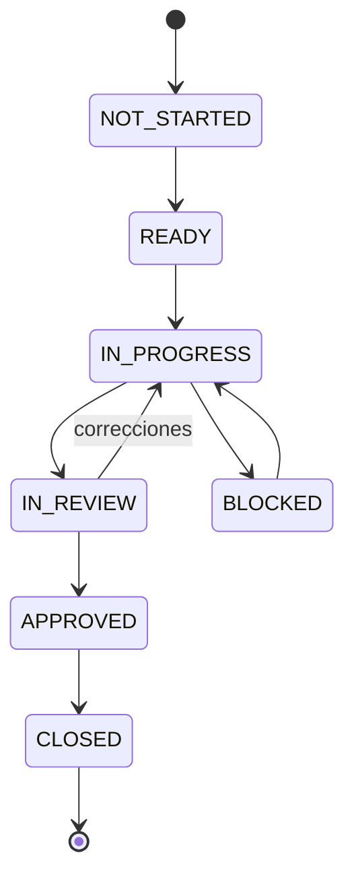
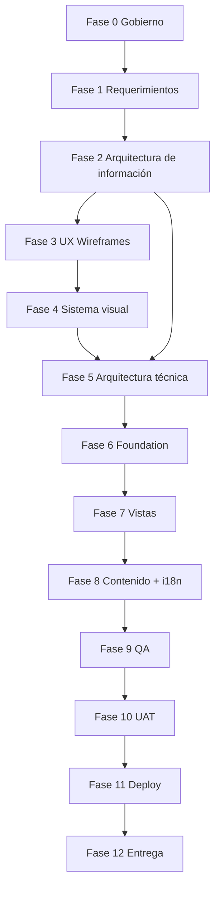

# ORQUESTADOR MAESTRO DEL PROYECTO
## Sitio web académico bilingüe — Cabellos Research Group

**Repositorio:** `cabellos-research-group-web`  
**Dominio previsto:** `cabellosresearchgroup.org`  
**Tipo de solución:** sitio web académico estático, bilingüe, responsive y orientado a contenido  
**Stack base aprobado:** Astro + TypeScript + Astro Content Collections; React únicamente cuando una interacción lo justifique  
**Infraestructura prevista:** GitHub privado + Cloudflare Pages + Cloudflare DNS  
**Idiomas:** español e inglés  
**Benchmark de calidad:** TheoChemMerida (`theochemmerida.org`) como referencia de profundidad académica y profesionalismo, **no como plantilla gráfica ni fuente para copiar diseño**.  
**Estado del proyecto al crear este documento:** repositorio levantado y primer commit realizado.  
**Documento:** rector técnico y operativo del proyecto  
**Versión inicial:** 1.0  
**Fecha base:** 2026-09-23

---

# 0. PROPÓSITO DE ESTE DOCUMENTO

Este archivo es el **orquestador maestro** del desarrollo del sitio web. Su función es impedir que el proyecto avance por improvisación, decisiones aisladas o implementación prematura.

A partir de este documento, cualquier actividad nueva deberá poder responder con claridad:

1. ¿En qué fase se encuentra?
2. ¿Qué prerrequisitos necesita?
3. ¿Cuál es el resultado esperado?
4. ¿Qué archivos o evidencias debe producir?
5. ¿Qué criterios permiten considerarla terminada?
6. ¿Quién debe revisarla o validarla?
7. ¿Qué fase depende de ella?
8. ¿Qué decisiones están congeladas y cuáles siguen abiertas?
9. ¿Qué cambio de alcance implicaría?
10. ¿Qué prueba demuestra que funciona?

El proyecto se administrará como una secuencia de **fases con Stage Gates**. Una fase no se cierra porque “ya se trabajó en ella”; se cierra únicamente cuando cumple sus criterios de aceptación y existe evidencia verificable.

Este documento debe mantenerse versionado dentro del repositorio. Si cambia una decisión importante del proyecto, se modifica este orquestador o se crea un ADR correspondiente.

---

# 1. REGLA PRINCIPAL DE EJECUCIÓN

> **No se inicia una fase posterior si la fase de la que depende no ha alcanzado su Gate de salida.**

Excepciones:

- puede hacerse exploración técnica aislada;
- pueden prepararse pruebas de concepto;
- puede investigarse una solución futura;
- puede recopilarse contenido de fases posteriores.

Sin embargo, una exploración:

- no se considera implementación final;
- no puede introducir arquitectura definitiva sin decisión registrada;
- no puede usarse para saltar un Gate;
- no debe forzar a modificar una fase anterior para justificar código ya escrito.

---

# 2. OBJETIVO GENERAL DEL PROYECTO

Diseñar, desarrollar, validar y publicar un sitio web académico bilingüe que represente de forma profesional al grupo de investigación, permita comunicar su identidad científica, áreas de investigación, integrantes y producción académica, y que mantenga una arquitectura sencilla, rápida, accesible y fácil de actualizar desde el repositorio.

La primera versión debe ser suficientemente sólida para operar como sitio institucional/académico real y suficientemente modular para poder crecer después sin rehacer la base del proyecto.

---

# 3. RESULTADO FINAL ESPERADO

Al finalizar el proyecto deben existir, como mínimo:

- sitio publicado bajo dominio propio;
- versión completa en español;
- versión completa en inglés;
- navegación consistente;
- seis apartados principales;
- vistas de detalle cuando el contenido lo requiera;
- diseño responsive;
- sistema visual coherente;
- perfiles académicos estructurados;
- líneas de investigación estructuradas;
- publicaciones organizadas;
- SEO técnico base;
- metadatos sociales;
- sitemap;
- `robots.txt`;
- página 404;
- optimización de imágenes;
- accesibilidad básica sólida;
- rendimiento alto;
- HTTPS;
- despliegue automatizado desde GitHub;
- documentación técnica;
- documentación de actualización de contenido;
- historial Git entendible;
- decisiones arquitectónicas documentadas;
- inventario claro de lo que queda fuera de alcance.

---

# 4. PRINCIPIOS PROFESIONALES DEL PROYECTO

## 4.1 Contenido antes que decoración

La estructura de la información se define antes que el diseño visual final.

No se diseñará una tarjeta sin saber qué datos debe representar.

No se decidirá una vista por estética si contradice la jerarquía del contenido.

---

## 4.2 Sistema antes que pantalla aislada

No se construirán componentes independientes únicamente porque “se ven bien”.

Tipografía, colores, espaciados, radios, sombras, botones, tarjetas y estados deben pertenecer a un sistema coherente.

---

## 4.3 Astro primero; JavaScript solo cuando aporte valor

El sitio será prioritariamente estático.

No se hidratarán componentes por costumbre.

React se utilizará únicamente cuando exista una interacción real que no resulte razonable resolver de forma nativa.

---

## 4.4 Datos estructurados antes que texto duplicado

Integrantes, publicaciones y líneas de investigación no deben quedar dispersos o duplicados manualmente en múltiples páginas.

El contenido debe tener una fuente clara.

---

## 4.5 Responsive desde la arquitectura, no al final

Cada vista debe ser diseñada y probada desde el inicio para:

- móvil;
- tableta;
- laptop;
- escritorio amplio.

---

## 4.6 Accesibilidad desde componentes base

No se deja la accesibilidad para “corregir al final”.

Los componentes deben nacer con:

- HTML semántico;
- foco visible;
- contraste suficiente;
- navegación por teclado;
- etiquetas adecuadas;
- `alt` correcto;
- jerarquía de encabezados;
- estados comprensibles.

---

## 4.7 Rendimiento como requisito

No se agregarán:

- librerías pesadas por comodidad;
- animaciones costosas;
- fuentes innecesarias;
- imágenes sin optimización;
- JavaScript sin justificación.

---

## 4.8 Diseño propio

TheoChemMerida se utiliza como benchmark para responder preguntas como:

- ¿la profundidad del perfil académico es suficiente?;
- ¿la investigación tiene el protagonismo correcto?;
- ¿el sitio se percibe como un grupo científico real?;
- ¿los visitantes pueden entender quiénes investigan y qué producen?;

No se copiarán:

- layouts exactos;
- composiciones;
- textos;
- recursos;
- estilos;
- animaciones;
- identidad gráfica.

---

# 5. METODOLOGÍA OFICIAL

Se utilizará un modelo híbrido:

**Waterfall ligero + Stage-Gate + prácticas iterativas internas.**

## 5.1 Waterfall ligero

Las grandes decisiones siguen una secuencia:

1. alcance;
2. información;
3. arquitectura;
4. UX;
5. diseño;
6. arquitectura técnica;
7. implementación;
8. integración;
9. calidad;
10. despliegue.

---

## 5.2 Stage-Gate

Cada fase tiene:

- entrada;
- trabajo;
- entregables;
- criterios de aceptación;
- Gate.

El Gate responde únicamente:

- `APROBADO`;
- `APROBADO CON OBSERVACIONES NO BLOQUEANTES`;
- `NO APROBADO`.

---

## 5.3 Iteración interna

Dentro de una fase sí se permiten varias versiones.

Ejemplo:

- Wireframe Home v1;
- revisión;
- Wireframe Home v2;
- aprobación.

Lo que no se permite es comenzar a desarrollar la Home final mientras la arquitectura de esa vista sigue abierta.

---

# 6. ESTADOS OFICIALES DE UNA FASE

Toda fase deberá tener uno de estos estados:

- `NOT_STARTED`
- `READY`
- `IN_PROGRESS`
- `IN_REVIEW`
- `BLOCKED`
- `APPROVED`
- `CLOSED`

Flujo normal:



Una fase `CLOSED` solo debe reabrirse si un cambio aprobado impacta directamente decisiones ya congeladas.

---

# 7. DEFINICIONES OPERATIVAS

## 7.1 Definition of Ready — DoR

Una tarea está lista para comenzar cuando:

- tiene objetivo;
- tiene alcance;
- tiene entradas disponibles;
- no depende de una decisión pendiente crítica;
- tiene criterio de aceptación;
- se conoce dónde se documentará;
- se conoce qué parte del sistema afecta.

---

## 7.2 Definition of Done — DoD global

Una tarea se considera terminada cuando:

- cumple el objetivo;
- cumple los criterios de aceptación;
- no deja errores conocidos bloqueantes;
- el código está limpio cuando aplica;
- el proyecto compila cuando aplica;
- fue revisada;
- fue probada;
- la documentación fue actualizada;
- no introduce regresiones conocidas;
- fue registrada en Git cuando corresponde.

---

## 7.3 Definition of Done de una vista

Una vista no está terminada hasta contar con:

- propósito definido;
- estructura aprobada;
- diseño desktop;
- diseño mobile;
- contenido definido o placeholder formalmente aceptado;
- componentes reutilizables definidos;
- implementación funcional;
- versión ES;
- versión EN cuando aplique;
- navegación correcta;
- responsive verificado;
- accesibilidad revisada;
- SEO revisado;
- imágenes optimizadas;
- estados interactivos revisados;
- enlaces verificados;
- QA completado;
- ausencia de errores visuales bloqueantes.

---

# 8. ROLES Y RESPONSABILIDADES

## 8.1 Responsable técnico / desarrollador

Responsabilidades:

- planificación técnica;
- arquitectura;
- implementación;
- Git;
- documentación;
- UX/UI cuando corresponda;
- QA técnico;
- SEO técnico;
- optimización;
- despliegue;
- mantenimiento de este orquestador.

---

## 8.2 Responsable académico / cliente

Responsabilidades:

- validar información científica;
- confirmar identidad oficial;
- aprobar contenido público;
- proporcionar o autorizar fotografías;
- confirmar líneas de investigación;
- validar integrantes;
- validar publicaciones;
- resolver dudas científicas;
- revisar entregables funcionales clave.

---

## 8.3 Validador de contenido en inglés

Debe quedar identificado antes del cierre de traducción.

Responsabilidades:

- revisar equivalencia semántica;
- validar terminología científica;
- corregir nombres oficiales;
- evitar traducciones literales incorrectas.

---

## 8.4 Regla de autoridad

El desarrollador decide:

- implementación;
- estructura del código;
- arquitectura frontend;
- estrategia de componentes;
- optimización;
- herramientas técnicas.

El responsable académico valida:

- contenido científico;
- representación institucional;
- información pública;
- nombres;
- roles;
- publicaciones;
- textos finales.

Las decisiones mixtas, como organización visual de contenido académico, requieren acuerdo.

---

# 9. ALCANCE FUNCIONAL BASE

Se mantienen seis apartados principales:

1. Inicio / Home
2. Nosotros / About
3. Investigación / Research
4. Integrantes / Team
5. Publicaciones / Publications
6. Contacto / Contact

La existencia de seis apartados principales **no limita** la creación de páginas internas de detalle.

---

# 10. ALCANCE NO FUNCIONAL

El sitio debe ser:

- rápido;
- responsive;
- mantenible;
- accesible;
- indexable;
- seguro dentro de la naturaleza estática del proyecto;
- compatible con navegadores modernos;
- bilingüe;
- visualmente consistente;
- escalable en contenido;
- fácil de desplegar;
- fácil de recuperar ante errores.

---

# 11. FUERA DE ALCANCE DE LA PRIMERA VERSIÓN

Salvo aprobación formal de cambio:

- login;
- registro de usuarios;
- panel administrativo;
- base de datos de aplicación;
- CMS;
- backend propio;
- dashboards;
- mensajería interna;
- comentarios;
- foros;
- pagos;
- autenticación;
- roles;
- buscador avanzado con servidor;
- servidor de correo;
- almacenamiento de formularios propio;
- área privada;
- aplicación móvil;
- portal de alumnos;
- sistema de gestión de proyectos;
- scraping permanente de publicaciones;
- sincronización automática con ORCID/Scholar;
- traducción científica profesional contratada;
- analítica avanzada de usuarios;
- rediseño institucional externo al sitio.

---

# 12. MAPA DE RUTAS OBJETIVO

La estructura exacta se congela en la fase de arquitectura de información.

Propuesta inicial:

```text
/
├── nosotros/
├── investigacion/
│   └── [slug]/
├── integrantes/
│   └── [slug]/
├── publicaciones/
├── contacto/
└── 404

/en/
├── about/
├── research/
│   └── [slug]/
├── team/
│   └── [slug]/
├── publications/
├── contact/
└── 404
```

Se recomienda español como idioma sin prefijo y `/en/` para inglés, siempre que esta decisión sea aprobada antes de implementación.

---

# 13. INVENTARIO PRELIMINAR DE VISTAS

IDs estables para documentación:

| ID | Vista | Tipo |
|---|---|---|
| VIEW-001 | Home | principal |
| VIEW-002 | Nosotros / About | principal |
| VIEW-003 | Investigación / Research | principal |
| VIEW-003-D | Detalle de investigación | dinámica |
| VIEW-004 | Integrantes / Team | principal |
| VIEW-004-D | Perfil de integrante | dinámica |
| VIEW-005 | Publicaciones | principal |
| VIEW-006 | Contacto | principal |
| VIEW-404 | No encontrado | sistema |

Si durante arquitectura aparecen nuevas vistas justificadas, se agregan con ID y ADR o registro de cambio cuando modifiquen alcance.

---

# 14. ESPECIFICACIÓN PRELIMINAR DE VISTAS

## VIEW-001 — Home

### Propósito

Responder en pocos segundos:

- quién es el grupo;
- qué investiga;
- por qué importa;
- quién participa;
- qué producción científica tiene;
- dónde profundizar.

### Bloques propuestos

1. Header
2. Hero
3. Introducción breve
4. Áreas/líneas de investigación destacadas
5. Bloque de identidad científica
6. Integrantes destacados
7. Publicaciones recientes o destacadas
8. Colaboraciones/afiliaciones si aplican
9. CTA de exploración
10. Footer

### Consideraciones

- evitar convertir el Home en copia completa de todas las páginas;
- cada bloque debe conducir a contenido profundo;
- el primer viewport debe transmitir identidad científica;
- el Hero no debe depender de texto excesivo;
- imágenes decorativas y científicas deben diferenciarse semánticamente.

---

## VIEW-002 — Nosotros / About

### Propósito

Explicar la identidad institucional y académica.

### Contenido posible

- quiénes somos;
- propósito;
- misión o equivalente si existe;
- enfoque;
- trayectoria;
- institución;
- colaboraciones;
- valores científicos únicamente si son reales y aprobados;
- fotografía institucional.

### Riesgo

No inventar narrativa institucional para “llenar” la página.

---

## VIEW-003 — Investigación / Research

### Propósito

Dar una visión estructurada de los campos de trabajo.

### Bloques

- encabezado;
- introducción;
- grid/lista de áreas;
- proyectos destacados si existen;
- vínculos con integrantes;
- vínculos con publicaciones.

### Cada área debe poder incluir

- nombre;
- slug;
- resumen;
- descripción;
- imagen;
- investigadores relacionados;
- publicaciones relacionadas;
- proyectos relacionados;
- palabras clave opcionales.

---

## VIEW-003-D — Detalle de investigación

### Propósito

Profundizar una línea sin sobrecargar la vista principal.

### Bloques

- breadcrumb;
- título;
- resumen;
- imagen principal;
- explicación;
- integrantes relacionados;
- proyectos relacionados;
- publicaciones relacionadas;
- navegación hacia otras áreas.

---

## VIEW-004 — Integrantes / Team

### Propósito

Presentar estructura humana del grupo.

### Posibles agrupaciones

Se definirán con contenido real, por ejemplo:

- investigador principal;
- investigadores;
- estudiantes;
- colaboradores;
- egresados/alumni.

No se implementarán categorías vacías.

---

## VIEW-004-D — Perfil de integrante

### Propósito

Presentar una identidad académica profunda y creíble.

### Campos potenciales

- fotografía;
- nombre;
- grado;
- cargo;
- afiliación;
- biografía;
- líneas de investigación;
- intereses;
- proyectos;
- publicaciones seleccionadas;
- reconocimientos;
- ORCID;
- Google Scholar;
- ResearchGate;
- Scopus u otros;
- correo público autorizado;
- enlaces externos.

Solo se muestran datos disponibles.

---

## VIEW-005 — Publicaciones

### Propósito

Concentrar producción científica y facilitar acceso a la fuente original.

### Capacidades base

- agrupación por año;
- autores;
- título;
- revista;
- volumen/número si aplica;
- año;
- DOI;
- enlace externo;
- tipo de publicación si se decide modelarlo;
- destacado opcional.

### Consideraciones

La lista debe seguir siendo legible con crecimiento futuro.

No debe requerir rediseño cada vez que aumente el número de publicaciones.

---

## VIEW-006 — Contacto

### Propósito

Proporcionar canales académicos autorizados.

### Posibles datos

- correo;
- teléfono si es público;
- institución;
- ubicación institucional;
- enlaces institucionales;
- perfiles sociales/académicos;
- mapa solo si aporta valor y está aprobado.

### Primera versión

No se requiere backend de formulario.

---

## VIEW-404 — No encontrado

Debe:

- ser coherente con el diseño;
- explicar el error;
- dar salida al Home;
- conservar navegación;
- funcionar en ES/EN según arquitectura.

---

# 15. MODELO DE CONTENIDO

El modelo definitivo se congela antes de la carga masiva.

## 15.1 Entidad `Member`

Campos candidatos:

```text
id
slug
locale
name
academicTitle
role
affiliation
photo
photoAlt
shortBio
biography
researchAreas[]
projects[]
selectedPublications[]
email
orcid
googleScholar
researchGate
scopus
website
order
featured
active
```

---

## 15.2 Entidad `ResearchArea`

```text
id
slug
locale
title
shortDescription
description
image
imageAlt
members[]
projects[]
publications[]
keywords[]
featured
order
```

---

## 15.3 Entidad `Publication`

```text
id
slug?
locale?
title
authors[]
journal
year
volume
issue
pages
doi
url
type
featured
researchAreas[]
members[]
citation
```

No todos los campos deben ser obligatorios.

---

## 15.4 Entidad `Project` — solo si hay contenido suficiente

```text
id
slug
locale
title
summary
description
status
startYear
endYear
members[]
researchAreas[]
publications[]
externalUrl
```

No se creará esta entidad si solo existirán uno o dos textos sin necesidad de relación.

---

# 16. POLÍTICA DE CONTENIDO

## 16.1 Fuente de verdad

Cada dato debe poder atribuirse a:

- información proporcionada por el grupo;
- perfil académico oficial;
- publicación original;
- fuente institucional autorizada.

---

## 16.2 Placeholders

Se permiten durante diseño y desarrollo.

Deben ser claramente identificables.

Antes de producción no deben quedar:

- Lorem ipsum;
- correos ficticios;
- DOI ficticios;
- nombres ficticios;
- fotografías genéricas presentadas como reales.

---

## 16.3 Fotografías

Antes de publicar:

- confirmar autorización;
- definir recorte;
- optimizar;
- generar dimensiones apropiadas;
- escribir `alt` adecuado;
- evitar imágenes de resolución insuficiente.

---

## 16.4 Traducción

Flujo obligatorio:

```text
Texto ES aprobado
      ↓
Traducción EN
      ↓
Revisión terminológica
      ↓
Validación académica
      ↓
Publicación
```

No traducir un texto español que todavía cambia continuamente.

---

# 17. ARQUITECTURA TÉCNICA

## 17.1 Astro

Responsable de:

- routing;
- páginas;
- layouts;
- generación estática;
- integración de contenido;
- metadatos;
- optimización estructural.

---

## 17.2 TypeScript

Debe utilizarse para:

- props;
- utilidades;
- estructuras de datos;
- componentes;
- configuración;
- contratos internos.

Evitar `any` sin justificación.

---

## 17.3 React

Regla:

> Si un componente no necesita estado de cliente complejo o interacción rica, se implementa en Astro o HTML/CSS/JS nativo.

React debe justificarse antes de agregar hidratación.

---

## 17.4 Content Collections

Candidatos principales:

- members;
- research;
- publications;
- projects si aplica.

Se utilizarán schemas para detectar datos incompletos durante build.

---

## 17.5 Renderizado

Primera opción:

**Static Site Generation.**

SSR solo se considerará si aparece un requisito real que no pueda satisfacerse razonablemente de forma estática.

---

# 18. ARQUITECTURA i18n

## 18.1 Idiomas

- `es`
- `en`

## 18.2 Decisión propuesta

- español: idioma por defecto;
- inglés: prefijo `/en/`.

Debe confirmarse en ADR antes de congelar routing.

## 18.3 Requisitos SEO bilingües

Cada página equivalente debe considerar:

- `lang`;
- canonical;
- `hreflang`;
- alternancia ES/EN;
- títulos traducidos;
- descripciones traducidas;
- slugs definidos por política;
- OG metadata coherente.

## 18.4 Selector de idioma

Debe:

- conservar contexto equivalente cuando exista;
- no enviar siempre al Home;
- ser accesible por teclado;
- comunicar claramente el idioma.

---

# 19. ESTRUCTURA OBJETIVO DEL REPOSITORIO

La estructura final puede cambiar mediante ADR.

```text
cabellos-research-group-web/
│
├── docs/
│   ├── 00-orquestador-maestro.md
│   ├── 01-project-charter.md
│   ├── 02-requirements.md
│   ├── 03-content-inventory.md
│   ├── 04-information-architecture.md
│   ├── 05-view-specifications.md
│   ├── 06-design-system.md
│   ├── 07-content-model.md
│   ├── 08-technical-architecture.md
│   ├── 09-qa-plan.md
│   ├── 10-deployment.md
│   ├── 11-maintenance.md
│   │
│   ├── adr/
│   │   ├── ADR-001-astro.md
│   │   ├── ADR-002-static-rendering.md
│   │   ├── ADR-003-i18n-routing.md
│   │   ├── ADR-004-content-collections.md
│   │   └── ...
│   │
│   ├── views/
│   │   ├── VIEW-001-home.md
│   │   ├── VIEW-002-about.md
│   │   ├── VIEW-003-research.md
│   │   ├── VIEW-003-D-research-detail.md
│   │   ├── VIEW-004-team.md
│   │   ├── VIEW-004-D-member-detail.md
│   │   ├── VIEW-005-publications.md
│   │   ├── VIEW-006-contact.md
│   │   └── VIEW-404.md
│   │
│   └── qa/
│       ├── responsive-checklist.md
│       ├── accessibility-checklist.md
│       ├── seo-checklist.md
│       └── release-checklist.md
│
├── public/
│   ├── images/
│   ├── icons/
│   └── ...
│
├── src/
│   ├── assets/
│   ├── components/
│   │   ├── global/
│   │   ├── navigation/
│   │   ├── content/
│   │   └── ui/
│   ├── content/
│   ├── layouts/
│   ├── pages/
│   ├── styles/
│   ├── utils/
│   ├── i18n/
│   └── content.config.ts
│
├── astro.config.mjs
├── package.json
├── tsconfig.json
├── README.md
└── ...
```

---

# 20. REGLAS DE COMPONENTIZACIÓN

Crear un componente cuando:

- se repite;
- tiene responsabilidad clara;
- necesita props;
- tiene estados propios;
- encapsula comportamiento;
- mejora consistencia;
- facilita mantenimiento.

No crear componente si:

- es una única etiqueta trivial sin valor;
- solo fragmenta el código;
- vuelve difícil leer la jerarquía;
- se abstrae antes de conocer el patrón real.

---

# 21. SISTEMA DE DISEÑO

Debe definirse antes de maquetar todas las vistas.

## 21.1 Foundations

### Color

Definir tokens, no valores dispersos:

```text
--color-bg
--color-surface
--color-text
--color-text-muted
--color-primary
--color-primary-hover
--color-border
--color-accent
--color-success
--color-warning
--color-error
```

### Tipografía

Definir:

- familia principal;
- familia secundaria si existe;
- escala;
- peso;
- line-height;
- tracking;
- ancho máximo de lectura.

### Espaciado

Usar escala consistente.

Ejemplo conceptual:

```text
space-1
space-2
space-3
space-4
space-6
space-8
space-12
space-16
space-24
```

### Otros tokens

- radios;
- bordes;
- sombras;
- z-index;
- duración de transiciones;
- easing;
- breakpoints;
- tamaños de contenedor.

---

## 21.2 Componentes UI mínimos

Candidatos:

- Button
- Link
- IconLink
- Container
- Section
- SectionHeader
- Tag
- Badge
- Card
- ResearchCard
- MemberCard
- PublicationItem
- Breadcrumb
- LanguageSwitcher
- Navigation
- MobileMenu
- Footer
- SocialLinks
- ExternalLinkIndicator

---

## 21.3 Estados

Cada componente interactivo debe considerar:

- default;
- hover;
- focus-visible;
- active;
- disabled si aplica.

---

# 22. RESPONSIVE DESIGN

No trabajar únicamente con “desktop y luego reducir”.

Cada vista debe revisarse como sistema fluido.

## 22.1 Rangos de prueba mínimos

No son necesariamente breakpoints CSS; son tamaños de control.

- 320 px
- 360/375 px
- 390/430 px
- 768 px
- 1024 px
- 1280 px
- 1440 px
- 1920 px

## 22.2 Revisar

- navegación;
- overflow;
- tablas/listados;
- cards;
- imágenes;
- tipografía;
- espacios;
- botones;
- títulos largos;
- nombres académicos largos;
- DOI y URLs;
- cambio de idioma;
- footer.

---

# 23. ACCESIBILIDAD

Objetivo técnico: seguir buenas prácticas compatibles con **WCAG 2.2 nivel AA** en lo que aplique al alcance.

Checklist mínimo:

- un `h1` principal por vista;
- jerarquía lógica `h1-h2-h3`;
- `main`, `nav`, `header`, `footer`;
- skip link;
- teclado completo;
- foco visible;
- contraste;
- `alt`;
- labels;
- idioma del documento;
- enlaces distinguibles;
- propósito de enlaces claro;
- no depender solo del color;
- animaciones respetando `prefers-reduced-motion`;
- targets táctiles razonables;
- menú móvil accesible;
- no bloquear zoom.

---

# 24. SEO TÉCNICO

Cada ruta indexable debe definir:

- `<title>`;
- meta description;
- canonical;
- Open Graph;
- Twitter/X card si se decide;
- idioma;
- `hreflang`;
- favicon;
- sitemap;
- robots;
- estructura de encabezados;
- URLs estables;
- contenido indexable sin depender de JS;
- enlaces internos.

## 24.1 Datos estructurados

Evaluar JSON-LD únicamente cuando el marcado represente datos reales.

Posibles entidades:

- Organization;
- Person;
- ScholarlyArticle/Article cuando aplique;
- WebSite.

No agregar schema únicamente para “tener SEO”.

---

# 25. RENDIMIENTO

## 25.1 Objetivos de experiencia

Objetivos de referencia:

- LCP ≤ 2.5 s;
- INP ≤ 200 ms;
- CLS ≤ 0.1.

Estos objetivos deben considerarse en pruebas reales y no solo en Lighthouse.

## 25.2 Presupuesto técnico

- reducir JS enviado al cliente;
- evitar dependencias grandes;
- optimizar imágenes;
- definir dimensiones para evitar CLS;
- lazy-load fuera del viewport cuando corresponda;
- no lazy-load de forma incorrecta el contenido LCP;
- limitar fuentes;
- usar `font-display` apropiado;
- minimizar terceros;
- revisar CSS no utilizado;
- evitar video pesado automático salvo justificación.

## 25.3 Lighthouse

Meta interna recomendada en páginas representativas:

- Performance: 90+;
- Accessibility: 95+;
- Best Practices: 95+;
- SEO: 95+.

No se considera una certificación; es un control interno.

---

# 26. SEGURIDAD

Aunque sea un sitio estático:

- repositorio privado;
- 2FA recomendada;
- no subir secretos;
- `.env` fuera de Git;
- no exponer tokens;
- dependencias auditadas;
- HTTPS;
- headers de seguridad cuando la plataforma lo permita;
- validar enlaces externos;
- limitar scripts externos;
- no incrustar credenciales;
- formularios futuros requerirán nueva revisión.

---

# 27. PRIVACIDAD

Si no existe analítica ni formularios:

- mantener mínima recopilación de datos;
- evitar cookies innecesarias;
- no incluir rastreadores “por defecto”.

Si se agrega analítica:

- documentar proveedor;
- propósito;
- datos tratados;
- impacto en privacidad;
- banners/cookies si legalmente corresponden.

La analítica no debe agregarse sin decisión.

---

# 28. ESTRATEGIA GIT

## 28.1 Rama principal

`main`

Debe representar el estado integrable y estable del proyecto.

## 28.2 Trabajo

Para cambios medianos/grandes se recomienda:

```text
feature/<descripcion>
fix/<descripcion>
docs/<descripcion>
refactor/<descripcion>
chore/<descripcion>
```

En un proyecto de un solo desarrollador no es necesario burocratizar cada modificación pequeña.

## 28.3 Commits

Formato recomendado:

```text
type(scope): descripcion
```

Ejemplos:

```text
docs(project): add master orchestrator
feat(home): implement research highlights
feat(i18n): add english route structure
fix(nav): correct mobile focus management
refactor(content): normalize member schema
chore(deps): update project dependencies
```

## 28.4 Commits de cierre de fase

Ejemplo:

```text
docs(phase-1): close requirements phase
```

## 28.5 Tags sugeridos

```text
phase-0-baseline
phase-1-requirements
phase-2-information-architecture
phase-3-ux-wireframes
phase-4-design-system
phase-5-technical-architecture
phase-6-foundation
phase-7-views
phase-8-content-i18n
phase-9-qa
release-v1.0.0
```

---

# 29. ARCHITECTURE DECISION RECORDS — ADR

Crear ADR cuando una decisión:

- afecta arquitectura;
- sería costosa de revertir;
- modifica routing;
- agrega framework;
- agrega dependencia importante;
- cambia estrategia i18n;
- cambia fuente de contenido;
- cambia despliegue;
- agrega backend;
- agrega CMS.

Plantilla:

```md
# ADR-XXX — Título

## Estado
Propuesto / Aprobado / Reemplazado / Rechazado

## Contexto

## Decisión

## Alternativas consideradas

## Consecuencias positivas

## Consecuencias negativas

## Impacto

## Fecha
```

---

# 30. CONTROL DE CAMBIOS

Un cambio se clasifica:

## Tipo A — menor

No altera arquitectura, alcance ni plazo significativamente.

Ejemplos:

- texto;
- espacio;
- color dentro de sistema;
- ajuste visual pequeño.

## Tipo B — funcional

Agrega/modifica comportamiento ya contemplado.

Debe evaluarse.

## Tipo C — alcance

Ejemplos:

- nueva sección principal;
- CMS;
- login;
- base de datos;
- formulario con almacenamiento;
- blog;
- noticias;
- integración externa compleja.

Requiere:

1. describir solicitud;
2. justificar;
3. evaluar impacto;
4. estimar trabajo;
5. decidir;
6. documentar;
7. modificar alcance y cronograma si se acepta.

---

# 31. GESTIÓN DE RIESGOS

| Riesgo | Prob. | Impacto | Mitigación |
|---|---:|---:|---|
| contenido llega tarde | alta | alta | placeholders controlados + fecha de congelamiento |
| textos cambian después del diseño | media | media | validar contenido base antes de UI final |
| fotografías insuficientes | media | media | requisitos mínimos y fallback visual |
| inglés sin validar | media | alta | responsable de validación definido |
| scope creep | alta | alta | change control |
| sobrecarga de JS | baja | media | Astro-first |
| diseño inconsistente | media | alta | design system |
| publicaciones incompletas | alta | media | schema flexible + inventario |
| URLs cambian tarde | baja | alta | congelar IA/routing |
| dominio/DNS tarda | baja | media | preparar Cloudflare antes de release |
| optimización dejada al final | media | alta | performance budgets desde componentes |
| problemas responsive | media | alta | QA por vista, no solo QA final |
| datos académicos incorrectos | media | alta | aprobación del responsable académico |
| dependencia de una librería innecesaria | media | media | ADR y revisión antes de agregarla |

---

# 32. PLAN MAESTRO POR FASES

---

# FASE 0 — GOBIERNO, BASELINE Y ORQUESTACIÓN

**Objetivo:** congelar la forma en que se administrará el proyecto.

## Entradas

- repositorio existente;
- primer commit;
- propuesta técnica;
- alcance comercial;
- stack preliminar.

## Actividades

- crear este orquestador;
- registrar estado inicial;
- definir metodología;
- definir Stage Gates;
- definir DoR/DoD;
- definir Git;
- definir ADR;
- definir estructura documental;
- registrar alcance inicial;
- registrar fuera de alcance;
- verificar build base;
- verificar `.gitignore`;
- verificar exclusión local de archivos de agentes;
- registrar herramientas de desarrollo;
- establecer convenciones de nombres.

## Entregables

- `docs/00-orquestador-maestro.md`
- `docs/01-project-charter.md`
- estructura `docs/`
- ADR iniciales planificados

## Gate 0

Debe cumplirse:

- [ ] orquestador creado;
- [ ] alcance base registrado;
- [ ] metodología registrada;
- [ ] DoD definida;
- [ ] estrategia Git registrada;
- [ ] build base funciona;
- [ ] repositorio limpio;
- [ ] no hay secretos versionados;
- [ ] archivos locales de agentes no están trackeados.

**Salida:** `CLOSED`

---

# FASE 1 — DESCUBRIMIENTO, REQUERIMIENTOS Y CONTENIDO

**Objetivo:** saber exactamente qué debe representar el sitio y con qué material se cuenta.

## Prerrequisito

Gate 0 cerrado.

## Actividades de descubrimiento

### Identidad

Obtener:

- nombre oficial;
- nombre corto;
- logotipo;
- afiliación;
- identidad institucional;
- colores existentes;
- restricciones de uso.

### Grupo

Obtener:

- descripción;
- historia;
- propósito;
- enfoque;
- colaboraciones;
- infraestructura relevante si se publicará.

### Investigación

Por cada línea:

- título;
- resumen;
- descripción;
- integrantes;
- imágenes;
- proyectos;
- publicaciones vinculadas.

### Integrantes

Por persona:

- nombre;
- grado;
- rol;
- fotografía;
- biografía;
- investigación;
- links;
- correo autorizado.

### Publicaciones

Definir fuente:

- lista proporcionada;
- ORCID;
- DOI;
- perfiles académicos;
- bibliografía institucional.

Validar consistencia.

### Contacto

Confirmar:

- correo;
- teléfono;
- dirección;
- institución;
- enlaces.

### Inglés

Definir:

- quién traduce;
- quién valida;
- terminología oficial.

## Entregables

- `02-requirements.md`
- `03-content-inventory.md`
- carpeta de assets recibidos organizada;
- matriz de contenido faltante;
- lista de decisiones abiertas.

## Gate 1

- [ ] identidad confirmada;
- [ ] secciones confirmadas;
- [ ] integrantes iniciales identificados;
- [ ] líneas identificadas;
- [ ] fuente de publicaciones definida;
- [ ] canales de contacto confirmados;
- [ ] política ES/EN confirmada;
- [ ] faltantes conocidos y clasificados;
- [ ] ningún requisito crítico permanece ambiguo.

**No se exige tener cada texto final, pero sí conocer su existencia, propietario y estado.**

---

# FASE 2 — ARQUITECTURA DE INFORMACIÓN

**Objetivo:** definir cómo se organiza y navega todo el contenido.

## Prerrequisito

Gate 1 cerrado.

## Actividades

- sitemap;
- jerarquía;
- navegación principal;
- navegación secundaria;
- rutas;
- slugs;
- vistas dinámicas;
- relaciones entre entidades;
- user journeys;
- breadcrumbs;
- navegación ES/EN;
- 404;
- enlaces internos;
- profundidad máxima de navegación.

## User journeys mínimos

### Visitante académico

```text
Home
→ Research
→ Research Detail
→ Related Publication
```

### Visitante interesado en persona

```text
Home
→ Team
→ Member Detail
→ ORCID / Publication
```

### Visitante interesado en producción

```text
Search Engine
→ Publication page/list
→ DOI
```

### Visitante institucional

```text
Home
→ About
→ Contact
```

## Entregables

- `04-information-architecture.md`
- sitemap;
- tabla de rutas;
- navegación;
- relación contenido-vista.

## Gate 2

- [ ] todas las vistas tienen ID;
- [ ] cada vista tiene propósito;
- [ ] cada ruta está definida;
- [ ] ES/EN tiene estrategia;
- [ ] no existen páginas huérfanas;
- [ ] breadcrumbs definidos donde aplican;
- [ ] navegación móvil considerada;
- [ ] no hay contenido importante sin ubicación.

---

# FASE 3 — UX Y WIREFRAMES

**Objetivo:** definir jerarquía visual y comportamiento antes de diseñar estética final.

## Prerrequisito

Gate 2 cerrado.

## Actividades por vista

- estructura;
- prioridad;
- bloques;
- CTA;
- orden;
- densidad;
- comportamiento mobile;
- comportamiento desktop;
- componentes probables;
- contenido mínimo/máximo;
- casos de texto largo;
- estados vacíos.

## Wireframes mínimos

Para cada vista:

- mobile;
- desktop.

Para vistas complejas:

- tablet si aporta información.

## Entregables

- specs bajo `docs/views/`;
- wireframes;
- notas UX;
- mapa de componentes.

## Gate 3

- [ ] Home aprobado;
- [ ] About aprobado;
- [ ] Research aprobado;
- [ ] Research Detail aprobado;
- [ ] Team aprobado;
- [ ] Member Detail aprobado;
- [ ] Publications aprobado;
- [ ] Contact aprobado;
- [ ] 404 aprobado;
- [ ] mobile contemplado;
- [ ] contenido largo probado conceptualmente.

---

# FASE 4 — SISTEMA VISUAL Y UI

**Objetivo:** crear el lenguaje visual reusable.

## Prerrequisito

Gate 3 cerrado.

## Actividades

- mood direction;
- paleta;
- tipografía;
- grilla;
- contenedor;
- spacing;
- sombras;
- bordes;
- radius;
- iconos;
- fotografía;
- tratamiento de imágenes científicas;
- motion;
- botones;
- cards;
- headers;
- publicaciones;
- estados.

## Criterio de calidad

El diseño debe sentirse:

- académico;
- actual;
- intencional;
- ordenado;
- tecnológico sin caer en estética genérica de SaaS;
- con identidad propia.

## Entregables

- `06-design-system.md`
- tokens;
- catálogo de componentes;
- referencias visuales aprobadas.

## Gate 4

- [ ] foundations aprobados;
- [ ] componentes principales definidos;
- [ ] estados definidos;
- [ ] contraste revisado;
- [ ] sistema funciona en móvil;
- [ ] no hay estilos ad hoc necesarios para cada nueva pantalla.

---

# FASE 5 — ARQUITECTURA TÉCNICA Y MODELO DE DATOS

**Objetivo:** traducir UX/UI/contenido a software antes de construir el sitio completo.

## Prerrequisito

Gates 2, 3 y 4 cerrados.

## Actividades

- ADR Astro;
- ADR SSG;
- ADR i18n;
- ADR Content Collections;
- schema de Member;
- schema de Research;
- schema de Publication;
- schema de Project si aplica;
- strategy de imágenes;
- estrategia de componentes;
- routing;
- helpers;
- naming;
- SEO architecture;
- estructura de carpetas;
- estrategia de errores.

## Entregables

- `07-content-model.md`
- `08-technical-architecture.md`
- ADRs;
- schemas aprobados;
- árbol final de `src/`.

## Gate 5

- [ ] routing congelado;
- [ ] i18n congelado;
- [ ] data model definido;
- [ ] responsabilidades de componentes definidas;
- [ ] React justificado donde aplique;
- [ ] estrategia de imágenes definida;
- [ ] arquitectura no tiene dependencias innecesarias.

---

# FASE 6 — FOUNDATION IMPLEMENTATION

**Objetivo:** construir la base reusable sin llenar aún todas las vistas.

## Prerrequisito

Gate 5 cerrado.

## Actividades

- reset/base CSS;
- tokens;
- tipografía;
- layout;
- container;
- header;
- navegación;
- mobile navigation;
- footer;
- buttons;
- cards base;
- sections;
- breadcrumbs;
- idioma;
- SEO component/layout;
- content collections;
- utilidades;
- 404 base.

## Pruebas

- build;
- TypeScript;
- navegación teclado;
- mobile menu;
- no overflow;
- layout base.

## Gate 6

- [ ] base visual estable;
- [ ] navegación funciona;
- [ ] layout responsive;
- [ ] collections validan;
- [ ] build limpio;
- [ ] no errores críticos de consola;
- [ ] componentes foundations documentados.

---

# FASE 7 — IMPLEMENTACIÓN DE VISTAS

**Objetivo:** construir todas las vistas con estructura final.

## Orden recomendado

1. Home
2. About
3. Research
4. Research Detail
5. Team
6. Member Detail
7. Publications
8. Contact
9. 404

Cada vista pasa individualmente:

```text
READY
→ IMPLEMENTATION
→ RESPONSIVE
→ ACCESSIBILITY
→ REVIEW
→ DONE
```

## Regla

No declarar “fase de vistas terminada” si existen pantallas esenciales con placeholders estructurales pendientes.

## Gate 7

- [ ] todas las vistas implementadas;
- [ ] componentes reutilizados;
- [ ] desktop correcto;
- [ ] mobile correcto;
- [ ] navegación interna correcta;
- [ ] estados vacíos manejados;
- [ ] no existe contenido duplicado por mala arquitectura.

---

# FASE 8 — INTEGRACIÓN DE CONTENIDO E INTERNACIONALIZACIÓN

**Objetivo:** sustituir contenido de desarrollo por contenido real aprobado y completar ES/EN.

## Prerrequisito

Gate 7 cerrado en estructura.

## Actividades

- cargar miembros;
- cargar research;
- cargar publicaciones;
- revisar imágenes;
- completar ES;
- traducir EN;
- validar EN;
- relacionar entidades;
- verificar enlaces externos;
- revisar ortografía;
- revisar truncamientos;
- revisar slugs;
- revisar `hreflang`.

## Gate 8

- [ ] contenido ES completo;
- [ ] contenido EN completo;
- [ ] textos validados;
- [ ] imágenes reales;
- [ ] alt texts;
- [ ] links académicos válidos;
- [ ] DOI válidos;
- [ ] no placeholders de producción.

---

# FASE 9 — QA INTEGRAL

**Objetivo:** encontrar y corregir errores antes de que el cliente valide release.

## QA funcional

- enlaces;
- rutas;
- idioma;
- navegación;
- perfiles;
- publicaciones;
- 404.

## QA visual

- responsive;
- grids;
- imágenes;
- espaciados;
- fuentes;
- títulos largos;
- cards con alturas diferentes.

## QA accesibilidad

- teclado;
- foco;
- landmarks;
- headings;
- labels;
- contrastes;
- reduced motion.

## QA SEO

- títulos;
- descripciones;
- canonical;
- hreflang;
- sitemap;
- robots;
- OG.

## QA rendimiento

- Lighthouse;
- imágenes;
- JS;
- fuentes;
- Core Web Vitals lab/field cuando exista tráfico.

## Navegadores

Mínimo:

- Chrome;
- Edge;
- Firefox;
- Safari cuando exista acceso razonable a entorno de prueba.

## Gate 9

- [ ] cero bugs críticos;
- [ ] cero links internos rotos;
- [ ] cero placeholders;
- [ ] responsive aprobado;
- [ ] accessibility checklist;
- [ ] SEO checklist;
- [ ] performance checklist;
- [ ] build de producción exitoso.

---

# FASE 10 — UAT / VALIDACIÓN ACADÉMICA

**Objetivo:** que el responsable del grupo valide el contenido y experiencia final.

## Qué se valida

- nombres;
- cargos;
- textos;
- fotografías;
- líneas;
- publicaciones;
- contacto;
- inglés;
- orden;
- presentación global.

## Clasificación de observaciones

- bug;
- corrección de contenido;
- ajuste visual;
- cambio de alcance.

Los cambios de alcance no se mezclan automáticamente con correcciones.

## Gate 10

- [ ] observaciones bloqueantes resueltas;
- [ ] contenido aprobado;
- [ ] versión release candidate congelada.

---

# FASE 11 — DESPLIEGUE A PRODUCCIÓN

**Objetivo:** publicar release estable.

## Actividades

- configurar proyecto Cloudflare Pages;
- conectar GitHub;
- build command;
- output;
- variables si existen;
- preview;
- producción;
- dominio;
- DNS;
- HTTPS;
- redirects;
- canonical final;
- sitemap final;
- robots final;
- probar www/no-www según política.

## Smoke test post-deploy

- Home;
- About;
- Research;
- Member;
- Publications;
- Contact;
- EN;
- 404;
- HTTPS;
- links;
- favicon;
- OG;
- mobile.

## Gate 11

- [ ] dominio resuelve;
- [ ] HTTPS correcto;
- [ ] build automático;
- [ ] producción estable;
- [ ] smoke test;
- [ ] rollback conocido.

---

# FASE 12 — ENTREGA, DOCUMENTACIÓN Y MANTENIMIENTO

**Objetivo:** que el proyecto no dependa exclusivamente de memoria del desarrollador.

## Documentar

- cómo levantar proyecto;
- cómo instalar;
- cómo ejecutar;
- cómo hacer build;
- cómo agregar integrante;
- cómo agregar publicación;
- cómo agregar research;
- cómo actualizar imagen;
- cómo traducir;
- cómo desplegar;
- cómo recuperar versión;
- cómo revisar Cloudflare;
- quién controla dominio.

## Entregables

- README final;
- maintenance guide;
- deployment guide;
- release notes;
- inventario de credenciales **sin contraseñas**;
- decisiones pendientes para v2.

## Gate 12

- [ ] documentación reproducible;
- [ ] repositorio limpio;
- [ ] release tag;
- [ ] backup/ownership confirmado;
- [ ] proyecto oficialmente cerrado.

---

# 33. MAPEO TENTATIVO A CUATRO SEMANAS

Las semanas no sustituyen Gates.

## Semana 1

- Fase 0
- Fase 1
- Fase 2
- inicio Fase 3

## Semana 2

- cierre Fase 3
- Fase 4
- Fase 5
- inicio Fase 6

## Semana 3

- cierre Fase 6
- Fase 7
- inicio Fase 8

## Semana 4

- cierre Fase 8
- Fase 9
- Fase 10
- Fase 11
- Fase 12

Si contenido o aprobación externa bloquean una fase, registrar `BLOCKED`. No ocultar el bloqueo adelantando trabajo final no aprobado.

---

# 34. MATRIZ DE DEPENDENCIAS



---

# 35. TABLERO DE CONTROL DE FASES

Actualizar este bloque durante el proyecto.

| Fase | Estado | Responsable | Gate | Observaciones |
|---|---|---|---|---|
| 0 Gobierno | IN_PROGRESS | Desarrollo | pendiente | orquestador creado |
| 1 Requerimientos | NOT_STARTED | Desarrollo + académico | pendiente | |
| 2 IA | NOT_STARTED | Desarrollo | pendiente | |
| 3 UX | NOT_STARTED | Desarrollo | pendiente | |
| 4 UI | NOT_STARTED | Desarrollo | pendiente | |
| 5 Arquitectura técnica | NOT_STARTED | Desarrollo | pendiente | |
| 6 Foundation | NOT_STARTED | Desarrollo | pendiente | |
| 7 Vistas | NOT_STARTED | Desarrollo | pendiente | |
| 8 Contenido/i18n | NOT_STARTED | Mixto | pendiente | |
| 9 QA | NOT_STARTED | Desarrollo | pendiente | |
| 10 UAT | NOT_STARTED | Académico | pendiente | |
| 11 Deploy | NOT_STARTED | Desarrollo | pendiente | |
| 12 Entrega | NOT_STARTED | Desarrollo | pendiente | |

---

# 36. PROTOCOLO ANTES DE COMENZAR CUALQUIER TAREA

Antes de programar:

```text
TASK:
PHASE:
VIEW:
OBJECTIVE:
INPUTS:
DEPENDENCIES:
FILES TO TOUCH:
ACCEPTANCE CRITERIA:
TEST PLAN:
DOCUMENTATION IMPACT:
```

Si no puede rellenarse lo anterior, la tarea probablemente no está suficientemente definida.

---

# 37. PROTOCOLO AL TERMINAR CUALQUIER TAREA

Responder:

```text
WHAT CHANGED:
WHY:
FILES:
TESTS:
RESULT:
KNOWN LIMITATIONS:
DOCS UPDATED:
NEXT VALID TASK:
```

---

# 38. PLANTILLA DE ESPECIFICACIÓN DE VISTA

```md
# VIEW-XXX — Nombre

## Estado

## Objetivo

## Usuarios principales

## Ruta ES

## Ruta EN

## Contenido

## Jerarquía

## Secciones

## Componentes

## Interacciones

## Responsive

## Accesibilidad

## SEO

## Datos requeridos

## Estados vacíos

## Casos extremos

## Criterios de aceptación

## Dependencias

## Decisiones abiertas
```

---

# 39. PLANTILLA DE COMPONENTE

Antes de crear componente importante:

```md
# COMPONENT — Nombre

## Responsabilidad

## Dónde se usa

## Props

## Variantes

## Estados

## Responsive

## Accesibilidad

## Interacción

## Dependencias

## No debe hacer
```

---

# 40. MATRIZ DE PRUEBA DE VISTA

Por cada VIEW:

| Categoría | Estado |
|---|---|
| Contenido correcto | ☐ |
| Desktop | ☐ |
| Mobile | ☐ |
| Tablet | ☐ |
| Teclado | ☐ |
| Focus | ☐ |
| Contraste | ☐ |
| Imágenes | ☐ |
| ES | ☐ |
| EN | ☐ |
| SEO | ☐ |
| Links | ☐ |
| Build | ☐ |
| Console | ☐ |
| Performance | ☐ |

---

# 41. RELEASE CHECKLIST

Antes de `v1.0.0`:

## Contenido

- [ ] nombres correctos;
- [ ] cargos correctos;
- [ ] correos correctos;
- [ ] publicaciones verificadas;
- [ ] DOI revisados;
- [ ] fotografías autorizadas;
- [ ] ES validado;
- [ ] EN validado.

## UX/UI

- [ ] todas las vistas;
- [ ] mobile;
- [ ] tablet;
- [ ] desktop;
- [ ] hover;
- [ ] focus;
- [ ] menu;
- [ ] idioma;
- [ ] 404.

## SEO

- [ ] title;
- [ ] description;
- [ ] canonical;
- [ ] hreflang;
- [ ] sitemap;
- [ ] robots;
- [ ] OG;
- [ ] favicon.

## Rendimiento

- [ ] imágenes;
- [ ] fonts;
- [ ] JS;
- [ ] Lighthouse;
- [ ] CLS;
- [ ] LCP;
- [ ] INP controlado cuando pueda medirse.

## Seguridad

- [ ] HTTPS;
- [ ] no secretos;
- [ ] dependencias;
- [ ] enlaces externos;
- [ ] headers cuando corresponda.

## Infraestructura

- [ ] Cloudflare;
- [ ] GitHub;
- [ ] deploy automático;
- [ ] dominio;
- [ ] DNS;
- [ ] rollback.

## Documentación

- [ ] README;
- [ ] maintenance;
- [ ] deploy;
- [ ] content update;
- [ ] ADR;
- [ ] release notes.

---

# 42. CRITERIOS DE ÉXITO DEL PROYECTO

La web debe poder superar estas preguntas:

## Identidad

¿Un visitante nuevo entiende quién es el grupo?

## Investigación

¿Entiende qué investiga sin leer documentos externos?

## Personas

¿Puede identificar investigadores y profundizar en sus perfiles?

## Producción

¿Puede llegar con facilidad a publicaciones reales?

## Navegación

¿Puede moverse sin aprender cómo está organizado el sitio?

## Idioma

¿ES y EN representan el mismo proyecto con calidad equivalente?

## Móvil

¿La experiencia sigue pareciendo diseñada y no simplemente comprimida?

## Rendimiento

¿El sitio carga con rapidez y evita peso innecesario?

## Profesionalismo

¿El resultado se percibe al nivel de un grupo académico consolidado?

## Mantenimiento

¿Agregar una publicación o integrante no requiere reconstruir manualmente varias páginas?

---

# 43. COSAS QUE NO DEBEMOS HACER

- comenzar por animaciones;
- escoger librerías por moda;
- copiar TheoChemMerida;
- diseñar sin contenido;
- usar React para todo;
- crear un CMS sin necesidad;
- duplicar información ES/EN sin modelo;
- cargar imágenes originales gigantes;
- dejar responsive para el final;
- aprobar visuales solo en 1920 px;
- usar textos inventados en producción;
- mezclar correcciones con cambios de alcance;
- poner estilos inline sin sistema por rapidez;
- crear componentes prematuramente;
- implementar nuevas rutas sin actualizar IA;
- agregar dependencias sin revisar su valor;
- desplegar directamente sin release checklist;
- considerar “se ve bien en mi PC” como QA.

---

# 44. POLÍTICA DE CALIDAD FRENTE AL BENCHMARK

TheoChemMerida se usará para comparar **profundidad**, no apariencia.

Preguntas de control:

- ¿nuestra investigación está explicada con suficiente detalle?;
- ¿nuestros perfiles académicos tienen profundidad?;
- ¿las publicaciones son fáciles de encontrar?;
- ¿existe relación entre persona, research y producción?;
- ¿se percibe actividad científica?;
- ¿la navegación académica es clara?;
- ¿el sitio presenta identidad propia?;
- ¿el móvil conserva calidad?;
- ¿la interfaz parece una solución hecha a medida?;

El objetivo no es “parecernos” visualmente.

El objetivo es que un usuario pueda colocar ambos sitios en la misma categoría de profesionalismo académico.

---

# 45. FUENTES TÉCNICAS DE REFERENCIA

Durante decisiones técnicas deben priorizarse fuentes oficiales:

- documentación oficial de Astro;
- documentación oficial de Cloudflare;
- documentación oficial de GitHub;
- MDN Web Docs;
- W3C/WAI para accesibilidad;
- web.dev para Core Web Vitals;
- documentación del proveedor de dominio.

A septiembre de 2026, Astro mantiene soporte integrado para routing i18n y Content Collections, por lo que estas capacidades deben preferirse frente a soluciones caseras cuando cubran el requisito.

Los objetivos de Core Web Vitals utilizados en este documento son:

- LCP ≤ 2.5 s;
- INP ≤ 200 ms;
- CLS ≤ 0.1.

---

# 46. PRÓXIMO PASO OFICIAL

Después de incorporar este archivo al repositorio:

## Paso 1

Crear la carpeta documental:

```text
docs/
docs/adr/
docs/views/
docs/qa/
```

## Paso 2

Mover/copiar este documento como:

```text
docs/00-orquestador-maestro.md
```

## Paso 3

Crear:

```text
docs/01-project-charter.md
```

Ese documento debe congelar:

- identidad del proyecto;
- objetivo;
- alcance;
- stakeholders;
- constraints;
- assumptions;
- riesgos iniciales;
- definición de éxito.

## Paso 4

Cerrar formalmente Fase 0.

## Paso 5

Solo después iniciar Fase 1:

**Discovery + Requirements + Content Inventory.**

---

# 47. REGLA FINAL DEL ORQUESTADOR

> Cada avance del proyecto debe disminuir incertidumbre o producir una pieza verificable del producto. Si una actividad no puede relacionarse con una fase, un entregable, una decisión o un criterio de aceptación, debe cuestionarse antes de realizarla.

Este documento es la guía maestra. Los documentos subordinados pueden ampliar una fase, pero no contradecirla sin actualizar primero la decisión correspondiente.

