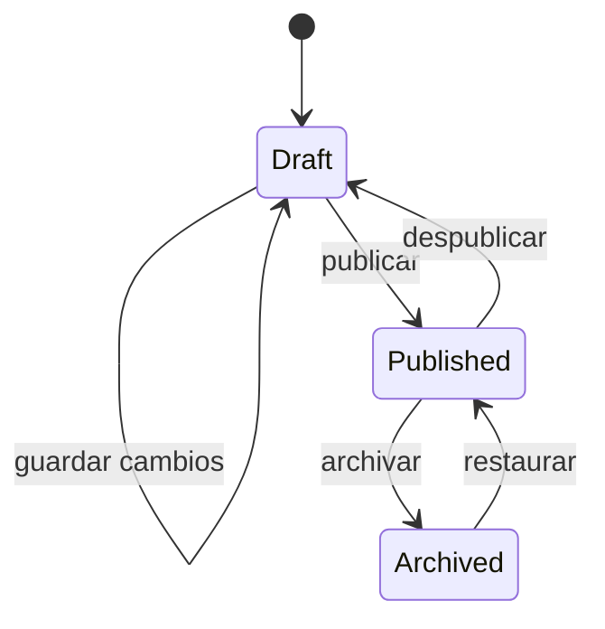
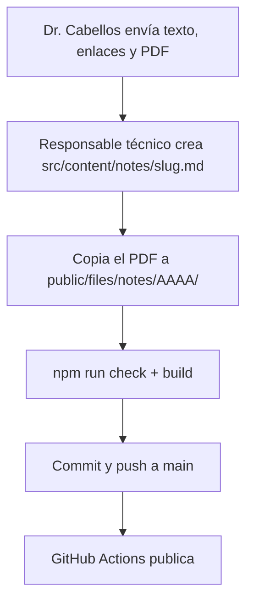
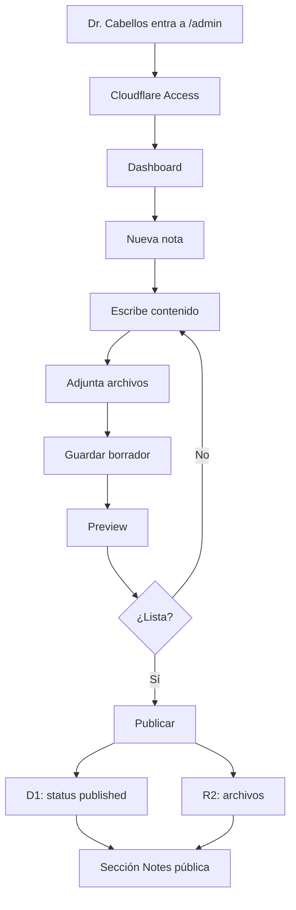
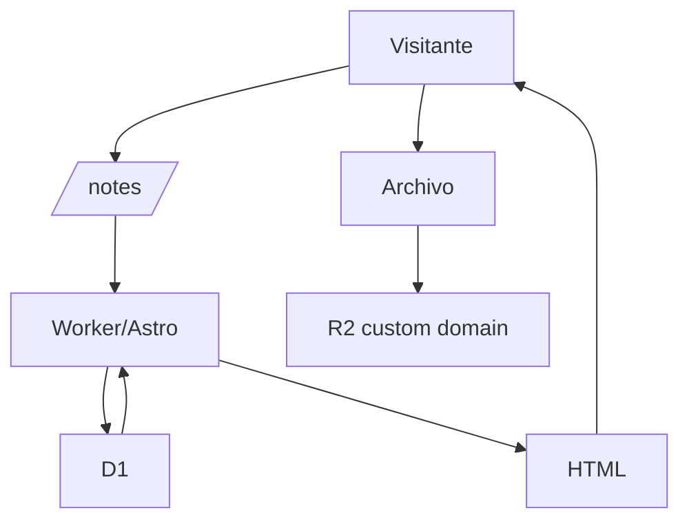
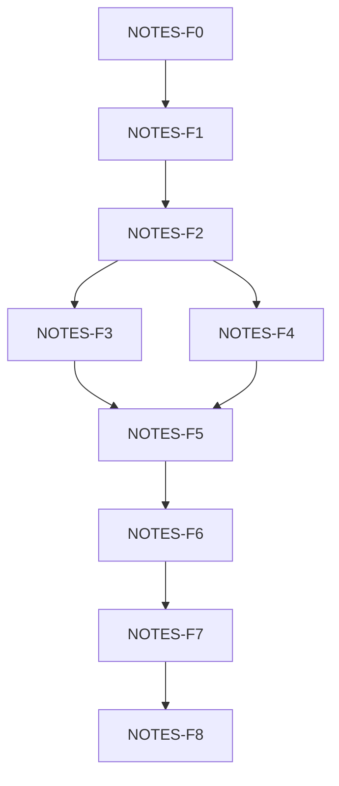

# ESPECIFICACIÓN TÉCNICA DEL MÓDULO EDITORIAL
## Notes / Notas — opiniones, lecturas recomendadas, libros y archivos — Cabellos Research Group

**Proyecto:** `cabellos-research-group-web`  
**Documento complementario a:** `docs/00-orquestador-maestro.md`  
**Tipo de documento:** especificación funcional, técnica y operativa del módulo editorial  
**Versión:** 1.1  
**Fecha:** 2026-09-29  
**Estado:** `ALCANCE APROBADO` — NOTES-F0 en cierre (faltan ADR, fichas de vista y wireframes; ver §110)  
**Nombre público:** Notes (EN) / Notas (ES)  
**Repositorio actual:** GitHub  
**Hosting actual:** GitHub Pages (vista previa en subruta `/cabellos-research-group-web/`)  
**Hosting objetivo futuro:** Cloudflare Workers con Static Assets  
**Dominio objetivo:** `cabellosresearchgroup.org`  
**Frontend:** Astro 7 + TypeScript  
**Persistencia futura de contenido editorial:** Cloudflare D1  
**Almacenamiento futuro de archivos:** Cloudflare R2  
**Protección del panel administrativo:** Cloudflare Access  
**Responsable técnico:** Walter Vilca  
**Editor principal futuro:** Dr. José Luis Cabellos Quiroz  
**Ubicación prevista del documento:** `docs/13-notes-editorial-module.md` (hoy está en la raíz del repositorio)

---

## Historial del documento

| Versión | Fecha | Cambios |
|---|---|---|
| 1.0 | 2026-09-29 | Propuesta inicial ("Blog / Recursos"). |
| 1.1 | 2026-09-29 | Decisiones del responsable técnico (§0). Nombre **Notes / Notas**; rutas alineadas con ADR-007 (EN en la raíz, ES bajo `/es/`); enlaces a archivos vía `withBase()`; tres categorías; política de idioma del contenido; notas de prueba; modelo provisional igual al modelo futuro (`status`, `lang`, referencias a integrante, tamaño y derechos del adjunto); estructura de código según las convenciones del repositorio; ADR con numeración del proyecto (ADR-008…014); registro del cambio Tipo C. |

---

# 0. DECISIONES APROBADAS Y REGISTRO DE CAMBIO TIPO C

## 0.1 Decisiones del responsable técnico (2026-09-29)

| # | Decisión |
|---|---|
| D-N1 | El módulo **entra en la V1** del sitio, en su forma pública estática (NOTES-F1). |
| D-N2 | Nombre público: **Notes** (EN) / **Notas** (ES). No forma parte de Galería. Rutas `/notes/` y `/es/notas/`. |
| D-N3 | Contenido previsto: opiniones del Dr. Cabellos, sugerencias de lectura de publicaciones con enlaces, recomendaciones de libros con enlace o con PDF para abrir o descargar. |
| D-N4 | La **interfaz** de la sección es bilingüe con el inglés como idioma principal y el español como secundario (igual que el resto del sitio). El **idioma de cada nota** lo decide el Dr. Cabellos; una nota se escribe una sola vez (§102). |
| D-N5 | Mientras no haya notas reales se trabaja con **notas de prueba** claramente marcadas, que nunca se publican en producción (§67). |
| D-N6 | Se prefiere la solución **sencilla**: tres categorías, sin páginas de etiquetas, sin buscador, sin traducción obligatoria. |
| D-N7 | La administración por CRUD (panel `/admin`) queda como **arquitectura objetivo** (Etapa B). Se activa según §149; no bloquea la V1. |

## 0.2 Registro de cambio (orquestador §30, Tipo C)

| Campo | Contenido |
|---|---|
| Solicitud | Añadir una sección editorial pública ("Notes / Notas") al sitio. |
| Justificación | El Dr. Cabellos necesita un espacio para opiniones y recomendaciones de lectura sin modificar las páginas estructurales. |
| Alcance V1 | Solo la sección pública estática (NOTES-F1): listado, categoría, detalle, adjuntos PDF, enlaces, SEO, responsive, accesibilidad. Contenido en archivos Markdown dentro del repositorio. |
| Fuera de la V1 | Panel, base de datos, autenticación y almacenamiento externo (NOTES-F2…F8). Siguen fuera de alcance según orquestador §11 hasta que se active la Etapa B (§149). |
| Impacto en fases | Reabre **solo para las vistas nuevas** los Gates 2 (IA), 3 (UX) y 4 (UI). El resto de vistas no se toca. Gate 7 sigue pendiente de la revisión visual. Gate 8 añade el criterio "sin notas de prueba publicadas". |
| Impacto en navegación | El menú pasa de 6 a 7 entradas (§6.2). |
| Impacto técnico | Nueva colección de contenido `notes`, clave de sección `notes` en `src/i18n/utils.ts`, textos de interfaz en `src/i18n/ui.ts`, carpeta `public/files/notes/`. Sin dependencias nuevas en la V1. |
| Esfuerzo estimado | NOTES-F1: una sesión de trabajo tras cerrar NOTES-F0. |
| Decisión | **APROBADO** por el responsable técnico, 2026-09-29. |

---

# 1. PROPÓSITO DEL DOCUMENTO

Este documento define cómo se construirá, operará y evolucionará el módulo editorial **Notes / Notas** del sitio web del grupo de investigación.

El módulo permitirá publicar:

- opiniones y comentarios del Dr. Cabellos;
- sugerencias de lectura de publicaciones científicas, con enlaces (DOI, editorial, acceso abierto);
- recomendaciones de libros, con enlace o con PDF para abrir o descargar cuando exista derecho de distribución;
- enlaces externos comentados;
- documentos PDF propios o de acceso abierto;
- anuncios breves relacionados con las actividades del grupo.

El documento complementa al orquestador maestro del proyecto y se interpreta bajo las mismas reglas:

- no improvisar arquitectura;
- no implementar funciones sin especificación;
- no saltar fases;
- documentar decisiones importantes;
- mantener criterios de aceptación;
- evitar dependencias innecesarias;
- preservar una evolución limpia entre la versión estática actual y la plataforma futura.

---

# 2. RELACIÓN CON EL ORQUESTADOR MAESTRO

El orquestador maestro gobierna todo el proyecto.

Este documento gobierna exclusivamente el módulo:

```text
Notes / Notas (contenido editorial, enlaces y archivos)
```

Si existe contradicción entre ambos documentos:

1. se revisa primero el orquestador;
2. se determina si esta especificación introduce una decisión nueva;
3. se registra la decisión;
4. se actualiza el documento que corresponda;
5. no se implementa una solución contradictoria sin documentarla.

Reglas del proyecto que este módulo hereda y no puede romper:

- **ADR-007:** inglés por defecto en la raíz; español bajo `/es/`, con rutas traducidas.
- **Enlaces internos:** todo enlace interno pasa por `sectionPath` / `withBase` (`src/i18n/utils.ts`), porque la vista previa vive en una subruta de GitHub Pages.
- **Estructura:** páginas mínimas en `src/pages/` que delegan en una vista de `src/views/`; componentes en `src/components/{content,ui,global}`.
- **Preferencias visuales:** fondo blanco puro, sombras, colores sobrios del sistema (`docs/06-design-system.md`), sin imágenes generadas con IA.

---

# 3. DECISIÓN ARQUITECTÓNICA PRINCIPAL

El módulo se diseña desde el inicio para funcionar en dos etapas.

## ETAPA A — V1 (estática)

```text
GitHub
   │
   ▼
Astro estático
   │
   ▼
GitHub Pages  →  después, el dominio final (puede seguir siendo estático)
```

El sitio continúa siendo estático.

Las notas son archivos Markdown en `src/content/notes/` y los adjuntos viven en `public/files/notes/`. Las publica el responsable técnico con un commit.

## ETAPA B — arquitectura objetivo (CRUD)

```text
GitHub
   │
   ▼
Cloudflare Workers + Static Assets
   │
   ├──────── sitio Astro
   │
   ├──────── API editorial
   │
   ├──────── D1
   │          └── notas / metadata
   │
   ├──────── R2
   │          └── PDF / imágenes / archivos
   │
   └──────── Cloudflare Access
              └── protección de /admin
```

La Etapa B será la arquitectura definitiva cuando se active la administración directa por parte del Dr. Cabellos (§149).

---

# 4. PRINCIPIO DE DESACOPLAMIENTO

Las vistas de Notes no deben conocer dónde está almacenado físicamente el contenido.

Un componente recibe datos ya normalizados:

```ts
{
  title,
  slug,
  summary,
  lang,
  publishedAt,
  author,      // { name, href } resuelto desde members
  category,    // { slug, label } en el idioma de la interfaz
  links,
  attachments
}
```

Hoy esos datos provienen de:

```text
Astro Content Collections (src/content/notes/)
```

Mañana:

```text
Cloudflare D1
```

La función que entrega los datos (`getNotes()` en `src/utils/content.ts`) es el único punto que cambia. Las vistas y componentes no se reescriben.

La misma regla aplica a archivos.

Hoy:

```text
withBase('/files/notes/2026/documento.pdf')
```

Mañana:

```text
https://files.cabellosresearchgroup.org/notes/2026/documento.pdf
```

Para la vista pública ambos son simplemente:

```text
attachment.url
```

La URL final se resuelve en la capa de datos, nunca dentro del componente.

---

# 5. OBJETIVO FUNCIONAL DEL MÓDULO

Proporcionar al grupo de investigación un espacio editorial donde el Dr. Cabellos comparta opiniones, lecturas y recursos sin modificar las páginas estructurales del sitio.

El módulo debe permitir que un visitante:

- descubra las notas recientes;
- lea notas completas;
- navegue por categorías;
- siga enlaces a publicaciones y libros;
- abra un PDF en otra pestaña o lo descargue;
- reconozca autor, fecha e idioma de la nota;
- relacione la nota con una línea de investigación cuando corresponda;
- navegue a otras notas;
- comparta una URL permanente.

En la fase administrativa futura (Etapa B) debe permitir que el Dr. Cabellos:

- cree una nota;
- guarde borradores;
- edite notas;
- publique;
- despublique;
- adjunte archivos;
- elimine archivos cuando corresponda;
- agregue enlaces;
- seleccione categoría;
- escriba etiquetas;
- añada imagen de portada;
- previsualice contenido;
- gestione notas sin tocar código.

---

# 6. NOMBRE DEL APARTADO Y NAVEGACIÓN

## 6.1 Nombre (decidido, D-N2)

| | EN | ES |
|---|---|---|
| Etiqueta de menú | Notes | Notas |
| Ruta | `/notes/` | `/es/notas/` |
| Entidad interna | `Note` | — |
| Colección | `notes` | — |

Se descartaron:

- **Blog:** tono informal, poco usual en sitios académicos.
- **Posts:** su traducción natural ("Publicaciones") choca con la sección de publicaciones científicas; "Entradas" suena extraño en un menú.

## 6.2 Menú

La sección va después de Publicaciones, porque buena parte del contenido son lecturas recomendadas:

```text
EN: Home · Research · People · Publications · Notes · Gallery · Contact us
ES: Inicio · Investigación · Integrantes · Publicaciones · Notas · Galería · Contáctanos
```

También se añade al pie de página. Se verifica que el menú de 7 entradas no se desborde en los anchos del header (≥ 900 px horizontal; < 900 px panel).

---

# 7. ALCANCE FUNCIONAL

El módulo incluirá:

- listado general;
- detalle de nota;
- categorías (tres, §9);
- etiquetas visibles en la nota (sin página propia en la V1);
- enlaces;
- archivos adjuntos PDF;
- nota destacada opcional;
- autor;
- fecha de publicación;
- fecha de actualización opcional;
- extracto;
- imagen principal opcional;
- contenido enriquecido (Markdown en la Etapa A);
- estados editoriales;
- indicador del idioma de la nota;
- SEO;
- versión responsive;
- interfaz ES/EN;
- futura administración (Etapa B).

---

# 8. FUERA DE ALCANCE INICIAL

No se incluye en la primera implementación:

- comentarios de visitantes;
- likes;
- reacciones;
- perfiles públicos de lectores;
- registro de usuarios externos;
- suscripciones de pago;
- foro;
- chat;
- edición colaborativa en tiempo real;
- sistema de newsletters;
- moderación comunitaria;
- publicación automática en redes;
- analítica editorial avanzada;
- motor de recomendación;
- almacenamiento ilimitado;
- versionado completo tipo Google Docs;
- aprobación multinivel;
- buscador;
- páginas por etiqueta y archivo por año;
- traducción obligatoria de las notas.

Cualquier elemento de esta lista requiere evaluación de alcance.

---

# 9. TIPOS DE CONTENIDO Y CATEGORÍAS

No se crearán múltiples sistemas independientes.

Se utilizará una entidad editorial común llamada:

```text
Note
```

y se distinguirá mediante categorías.

## Categorías V1 (D-N6)

| Slug EN | Slug ES | EN | ES | Uso |
|---|---|---|---|---|
| `opinion` | `opinion` | Opinion | Opinión | Opiniones y comentarios del Dr. Cabellos. |
| `readings` | `lecturas` | Readings | Lecturas | Artículos o publicaciones recomendadas, con enlace. |
| `books` | `libros` | Books | Libros | Libros recomendados, con enlace o PDF autorizado. |

Las categorías viven en configuración (`src/config/notes.ts`), no en cada nota: la nota solo guarda el identificador (`opinion`, `readings`, `books`).

Si más adelante hace falta otra categoría, se agrega a la configuración. No se crean categorías vacías por apariencia: una categoría sin notas publicadas no aparece en los filtros.

---

# 10. DIFERENCIA ENTRE CATEGORÍA Y ETIQUETA

## Categoría

Clasificación principal. Cada nota pertenece a exactamente una categoría.

Ejemplo:

```text
readings
```

## Etiquetas

Clasificaciones secundarias, opcionales.

Ejemplo:

```text
DFT
Clusters
Machine learning
```

Reglas:

- se escriben en inglés técnico o en el idioma de la nota, sin mezclar variantes;
- se normalizan (minúsculas y sin acentos) para detectar duplicados como `DFT`, `dft` y `Dft`;
- en la V1 se muestran en la nota, sin página propia.

---

# 11. ARQUITECTURA DE INFORMACIÓN

Rutas públicas (siguen ADR-007: EN en la raíz, ES bajo `/es/` con rutas traducidas):

| Vista | EN | ES |
|---|---|---|
| Listado | `/notes/` | `/es/notas/` |
| Listado, página n | `/notes/page/2/` | `/es/notas/pagina/2/` |
| Categoría | `/notes/category/[cat-en]/` | `/es/notas/categoria/[cat-es]/` |
| Detalle | `/notes/[slug]/` | `/es/notas/[slug]/` |

- El `slug` de la nota es el mismo en las dos interfaces (como los perfiles de integrantes).
- Todas las rutas se generan con funciones de `src/i18n/utils.ts` (`sectionPath('notes', lang)`, `notePath(slug, lang)`, `noteCategoryPath(cat, lang)`), que ya aplican `withBase`.
- Profundidad máxima: sección → categoría o detalle.

Rutas opcionales posteriores (fuera de la V1):

```text
/notes/tag/[slug]/
/notes/archive/[year]/
/rss.xml
```

Panel futuro (Etapa B, sin versión en español; interfaz del panel en español):

```text
/admin/
/admin/notes/
/admin/notes/new/
/admin/notes/[id]/
/admin/files/
```

API futura:

```text
/api/notes
/api/notes/[id]
/api/files
/api/files/[id]
```

---

# 12. VISTAS OFICIALES

Se añaden las siguientes vistas al inventario del proyecto.

| ID | Vista | Tipo | Etapa |
|---|---|---|---|
| VIEW-007 | Notes / Notas | pública | A (V1) |
| VIEW-007-C | Notas por categoría | pública | A (V1) |
| VIEW-007-D | Detalle de nota | pública | A (V1) |
| VIEW-ADMIN-001 | Dashboard editorial | privada | B |
| VIEW-ADMIN-002 | Listado de notas | privada | B |
| VIEW-ADMIN-003 | Editor de nota | privada | B |
| VIEW-ADMIN-004 | Gestor de archivos | privada | B |

Las vistas ADMIN no se implementan hasta entrar en la Etapa B.

---

# 13. VIEW-007 — NOTES

## Objetivo

Mostrar las notas del grupo de forma organizada y profesional.

## Estructura propuesta

1. Header global
2. Encabezado de sección (`PageHeader`)
3. Nota destacada (solo si existe)
4. Filtros por categoría (enlaces, sin JavaScript)
5. Lista de notas
6. Paginación (solo si hay más de una página)
7. Footer

## 13.1 Encabezado

Debe contener:

- título ("Notes" / "Notas");
- una frase breve que explique la sección;
- identidad visual coherente con el sitio.

No debe parecer una web independiente.

## 13.2 Nota destacada

Se muestra solo si existe una nota publicada con:

```text
featured = true
```

Si no existe:

- no mostrar bloque vacío;
- no reservar espacio artificial.

## 13.3 Tarjeta de nota

Cada tarjeta puede mostrar:

- categoría;
- título;
- extracto;
- fecha;
- autor;
- idioma de la nota (EN / ES) cuando no coincide con el de la interfaz;
- imagen opcional;
- indicador de PDF o enlaces cuando existan.

No mostrar metadata excesiva.

## 13.4 Orden

Por defecto:

```text
publishedAt DESC
```

Las notas recientes aparecen primero.

## 13.5 Estado vacío

Si no hay notas publicadas, la sección muestra un mensaje breve ("Notes will appear here soon." / "Pronto publicaremos notas aquí."), igual que la Galería. La sección nunca se rompe por falta de contenido.

---

# 14. VIEW-007-C — CATEGORÍA

Ejemplo:

```text
/notes/category/books/     /es/notas/categoria/libros/
```

Debe:

- indicar la categoría;
- mostrar descripción opcional;
- listar notas;
- mantener paginación;
- enlazar de regreso al listado completo.

---

# 15. VIEW-007-D — DETALLE DE NOTA

Ruta:

```text
/notes/[slug]/     /es/notas/[slug]/
```

## Estructura

1. Header
2. Breadcrumb (Inicio › Notes › título)
3. Categoría
4. Título
5. Resumen opcional
6. Autor (enlace a su perfil en People)
7. Fecha
8. Fecha actualizada si aplica
9. Idioma de la nota si no coincide con la interfaz
10. Imagen principal opcional
11. Contenido (con atributo `lang` del idioma de la nota)
12. Enlaces relacionados
13. Archivos adjuntos
14. Etiquetas
15. Navegación a la nota anterior y siguiente
16. Footer

---

# 16. CONTENIDO ENRIQUECIDO

El contenido debe soportar al menos:

- párrafos;
- encabezados H2-H4;
- negritas;
- cursivas;
- listas;
- listas numeradas;
- citas;
- enlaces;
- imágenes;
- bloques de código si se decide;
- tablas simples;
- separadores.

En la Etapa A el contenido se escribe en Markdown y lo procesa Astro.

En la Etapa B no se permitirá HTML arbitrario sin sanitización.

---

# 17. ARCHIVOS ADJUNTOS

Tipos inicialmente permitidos:

```text
application/pdf
```

Posteriormente se podrá habilitar:

- DOCX;
- PPTX;
- XLSX;
- ZIP;
- imágenes.

Cada nuevo tipo debe revisarse por seguridad y UX.

---

# 18. TRATAMIENTO DE PDF

Un PDF se modela como un `Attachment`.

Ejemplo:

```json
{
  "title": "Notas complementarias",
  "file": "2026/notas-orca-2026.pdf",
  "sizeBytes": 2457600,
  "rights": "author"
}
```

La interfaz muestra (con el componente `Icon` del sitio, no con emojis):

```text
[icono PDF] Notas complementarias
PDF · 2.3 MB

[ Open / Abrir ]   [ Download / Descargar ]
```

- **Abrir:** `target="_blank"` con `rel="noopener"` y aviso accesible de que se abre en otra pestaña.
- **Descargar:** atributo `download`.
- En la Etapa A el tamaño se calcula en el build leyendo el archivo de `public/files/notes/`; no se escribe a mano.

---

# 19. ALMACENAMIENTO PROVISIONAL DE ARCHIVOS

Mientras el sitio permanezca estático:

```text
public/
└── files/
    └── notes/
        └── YYYY/
```

Ejemplo:

```text
public/files/notes/2026/notas-orca.pdf
```

URL generada:

```text
withBase('/files/notes/2026/notas-orca.pdf')
→ /cabellos-research-group-web/files/notes/2026/notas-orca.pdf   (vista previa)
→ /files/notes/2026/notas-orca.pdf                                (dominio final)
```

En la nota solo se escribe la ruta relativa (`2026/notas-orca.pdf`); la capa de datos construye la URL.

Esta solución es válida únicamente para volumen pequeño y administración técnica. Límite de GitHub: 100 MB por archivo; límite del proyecto: 20 MB (§24).

---

# 20. ALMACENAMIENTO OBJETIVO — R2

Cuando se implemente el backend, `Cloudflare R2` será responsable de:

- PDF;
- imágenes editoriales;
- presentaciones;
- archivos descargables.

No se utilizará D1 para almacenar binarios.

---

# 21. ESTRUCTURA DEL BUCKET R2

Bucket propuesto:

```text
cabellos-research-files
```

Estructura lógica:

```text
notes/
├── 2026/
│   ├── <note-id>/
│   │   ├── document.pdf
│   │   └── cover.webp
│
├── 2027/
└── ...
```

Otros grupos futuros:

```text
resources/
publications/
presentations/
teaching/
```

---

# 22. POLÍTICA DE NOMBRES DE ARCHIVOS

No almacenar directamente nombres como:

```text
Mi presentación final FINAL 2 (corregida).pdf
```

Generar nombres seguros:

```text
2026-10-15-notas-orca.pdf
```

o:

```text
<uuid>-notas-orca.pdf
```

Reglas:

- minúsculas;
- sin espacios;
- sin caracteres especiales problemáticos;
- extensión validada;
- nombre original almacenado como metadata.

En la Etapa A estas reglas las aplica el responsable técnico al copiar el archivo; el build falla si el nombre no las cumple.

---

# 23. VALIDACIÓN DE ARCHIVOS

Antes de aceptar una subida (Etapa B):

- comprobar tipo MIME;
- comprobar extensión;
- comprobar tamaño;
- comprobar que se declaró el derecho de distribución (§99);
- generar nombre interno;
- rechazar extensiones no autorizadas;
- registrar usuario;
- registrar fecha;
- almacenar metadata.

No confiar únicamente en el nombre del archivo.

En la Etapa A el build comprueba: que el archivo existe, extensión `.pdf`, tamaño ≤ 20 MB y campo `rights` presente.

---

# 24. LÍMITE DE TAMAÑO

Valor inicial:

```text
20 MB por archivo
```

Este valor puede modificarse.

Objetivo:

- evitar cargas accidentales enormes;
- no inflar el repositorio en la Etapa A;
- reducir uso innecesario;
- mejorar experiencia.

Para archivos superiores se evaluará caso por caso.

---

# 25. R2 Y COSTOS

Cifras de referencia, **pendientes de verificar** contra la documentación oficial al iniciar NOTES-F4 (pueden haber cambiado):

- 10 GB-mes de almacenamiento Standard;
- 1 millón de operaciones Class A;
- 10 millones de operaciones Class B;
- transferencia de salida a Internet sin cargo de egress.

R2 requiere activar una suscripción mediante el proceso de checkout.

La existencia de una suscripción no significa una mensualidad fija por sí misma; el costo depende del uso que supere la cuota incluida.

Este proyecto debe:

- utilizar R2 Standard;
- monitorizar consumo;
- evitar cargas innecesarias;
- no asumir que un servicio gratuito es ilimitado.

---

# 26. MODELO `Note`

Modelo conceptual (común a la Etapa A y la Etapa B):

```text
Note
├── id
├── slug                 único, estable (§63–§65)
├── lang                 idioma del contenido: en | es (§102)
├── translation_of       opcional: id de la nota original si es una traducción
├── title
├── summary
├── content
├── author_id            → Author (vinculado a un integrante)
├── category             opinion | readings | books
├── status               draft | published | archived
├── is_test              true en notas de prueba (§67)
├── featured
├── cover_image          opcional
├── research_areas       opcional: líneas de investigación relacionadas
├── published_at
├── created_at
├── updated_at
├── seo_title            opcional
└── seo_description      opcional
```

No se guarda `canonical_url`: se deriva del idioma de la nota (§74).

---

# 27. MODELO `Attachment`

```text
Attachment
├── id
├── note_id
├── title
├── description
├── original_filename
├── storage_key          Etapa A: ruta bajo public/files/notes/ · Etapa B: clave R2
├── public_url           derivada, no se escribe a mano
├── mime_type
├── size_bytes           Etapa A: calculado en el build
├── rights               open-access | public-domain | author | permission (§99)
├── created_at
└── created_by
```

---

# 28. MODELO `ExternalLink`

```text
ExternalLink
├── id
├── note_id
├── title
├── url
├── kind                 doi | publisher | open-access | book | other
├── description
└── order
```

Un libro o artículo sin permiso para redistribuir el PDF se enlaza con un `ExternalLink` (§100, §121).

---

# 29. MODELO `Category`

```text
Category
├── id                   opinion | readings | books
├── slug_en
├── slug_es
├── name_en
├── name_es
├── description_en
├── description_es
└── active
```

En la Etapa A vive en `src/config/notes.ts`.

---

# 30. MODELO `Tag`

```text
Tag
├── id
├── slug
├── name
└── normalized_name
```

Relación:

```text
Note
   │
   └── many-to-many
            │
           Tag
```

En la Etapa A las etiquetas son una lista de texto en la nota; el build avisa si hay duplicados normalizados.

---

# 31. MODELO `Author`

En la primera versión puede existir un único autor editorial principal.

Modelo:

```text
Author
├── id
├── name
├── display_name
├── email
├── member_slug          → integrante de src/content/data/members.yaml
└── active
```

En la Etapa A la nota guarda solo `author: jose-luis-cabellos` (referencia a la colección de integrantes). El nombre, la foto y el enlace al perfil salen de esa colección.

No se necesita sistema complejo de usuarios editoriales.

---

# 32. D1 — RESPONSABILIDAD

Cloudflare D1 almacenará información estructurada.

Debe almacenar:

- notas;
- categorías;
- etiquetas;
- relaciones;
- metadata de archivos;
- enlaces externos;
- estado editorial.

No debe almacenar:

- PDF completos;
- fotografías pesadas;
- ZIP;
- videos.

---

# 33. ESQUEMA SQL CONCEPTUAL

Tablas iniciales:

```text
notes
authors
categories
tags
note_tags
attachments
external_links
```

Posible evolución:

```text
audit_log
note_revisions
```

Solo se agregan si existe requisito real.

---

# 34. ESTADOS EDITORIALES

Una nota tendrá:

```text
draft
published
archived
```

## draft

No visible públicamente.

## published

Visible públicamente.

## archived

Retirado de listados normales pero conservado. En la Etapa A una nota archivada no genera página.

No se recomienda eliminar permanentemente una nota desde la primera acción del usuario.

---

# 35. FLUJO EDITORIAL



En la Etapa A el "flujo" es cambiar el campo `status` y hacer commit.

---

# 36. PANEL ADMINISTRATIVO (ETAPA B)

Ruta objetivo:

```text
/admin/
```

No debe aparecer en navegación pública.

---

# 37. VIEW-ADMIN-001 — DASHBOARD

Debe mostrar:

- notas recientes;
- número de borradores;
- notas publicadas;
- accesos rápidos;
- archivos recientes;
- acción "Nueva nota".

No necesita analytics sofisticada.

---

# 38. VIEW-ADMIN-002 — NOTAS

Tabla/listado:

```text
Título
Estado
Categoría
Idioma
Fecha
Actualizado
Acciones
```

Acciones:

- editar;
- previsualizar;
- publicar/despublicar;
- archivar.

---

# 39. VIEW-ADMIN-003 — EDITOR

Campos mínimos:

```text
Título
Idioma de la nota
Resumen
Categoría
Etiquetas
Contenido
Imagen
Enlaces
Archivos (con derecho de distribución)
Estado
Fecha de publicación
```

Acciones:

```text
Guardar borrador
Previsualizar
Publicar
```

---

# 40. EXPERIENCIA DEL EDITOR

El Dr. Cabellos no debe necesitar conocer:

- Git;
- Markdown;
- ramas;
- commits;
- terminal;
- Astro;
- Cloudflare;
- rutas internas.

La interfaz debe comportarse como herramienta editorial.

Mientras no exista el panel (Etapa A), el Dr. envía el texto y los archivos al responsable técnico, que los publica.

---

# 41. EDITOR DE TEXTO

Se evaluará un editor enriquecido ligero.

Requisitos:

- contenido serializable;
- salida segura;
- compatibilidad con Astro;
- dependencia mantenida;
- accesibilidad;
- evitar bundle innecesariamente grande;
- se carga solo en `/admin`, nunca en páginas públicas.

Alternativa simplificada:

- editor Markdown con toolbar (mantiene el mismo formato que la Etapa A y simplifica la migración).

La decisión final se registrará en ADR-014 (§157).

---

# 42. AUTENTICACIÓN

No se implementará un sistema propio de contraseñas.

El panel se protegerá con:

```text
Cloudflare Access
```

Ventajas:

- evita implementar login;
- evita almacenar contraseñas;
- permite políticas por correo/identidad;
- protege rutas específicas.

Rutas:

```text
cabellosresearchgroup.org/admin/*
cabellosresearchgroup.org/api/*   (escritura)
```

solo accesibles a usuarios autorizados.

---

# 43. AUTORIZACIÓN

Usuarios previstos:

```text
Dr. José Luis Cabellos Quiroz
Walter Vilca (responsable técnico)
```

No se necesita RBAC avanzado.

Si en el futuro aparecen:

- múltiples autores;
- revisores;
- estudiantes;

se crea una fase específica de roles y permisos.

---

# 44. SEGURIDAD DEL PANEL

Requisitos mínimos:

- HTTPS;
- Access;
- endpoints administrativos protegidos;
- validación server-side;
- sanitización;
- CSRF según arquitectura;
- rate limiting cuando corresponda;
- no confiar en validación frontend;
- logs básicos;
- errores sin exponer detalles internos.

---

# 45. API EDITORIAL

API mínima propuesta:

```text
GET    /api/notes
POST   /api/notes
GET    /api/notes/:id
PUT    /api/notes/:id
DELETE /api/notes/:id
```

El `DELETE` se implementa como archivado lógico.

---

# 46. API DE ARCHIVOS

```text
POST   /api/files
GET    /api/files/:id
DELETE /api/files/:id
```

El navegador no recibe credenciales R2.

La función backend opera mediante binding.

---

# 47. API PÚBLICA

No se necesita exponer una API pública inicialmente.

La sección puede renderizar sus datos desde el servidor.

Esto reduce:

- superficie;
- complejidad;
- CORS;
- dependencias frontend.

---

# 48. RENDERIZADO

Etapa A (V1): **todo estático**, incluida la sección Notes (`getStaticPaths`).

Etapa B:

```text
Home                 STATIC
Research             STATIC
People               STATIC
Publications         STATIC
Gallery              STATIC
Contact              STATIC
Notes                DYNAMIC / ON-DEMAND
Note detail          DYNAMIC / ON-DEMAND
Admin                DYNAMIC
API                  DYNAMIC
```

---

# 49. POR QUÉ NO CONVERTIR TODO EN SSR

No existe necesidad.

Las páginas estructurales:

- cambian poco;
- son ideales para SSG;
- pueden servirse como assets;
- no necesitan consultas por solicitud.

La sección Notes sí se beneficia de datos actualizados inmediatamente una vez que exista el panel.

---

# 50. CLOUDFLARE WORKERS + STATIC ASSETS

Arquitectura objetivo recomendada:

```text
Cloudflare Worker
│
├── Static Assets
│   └── salida Astro estática
│
├── rutas dinámicas
│   ├── /notes/*  y  /es/notas/*
│   ├── /admin/*
│   └── /api/*
│
├── D1 binding
└── R2 binding
```

Cloudflare Workers puede desplegar en una misma unidad:

- código del Worker;
- assets estáticos;
- bindings.

Esto es preferible a administrar un VPS.

---

# 51. MIGRACIÓN DESDE GITHUB PAGES

La migración no será una reescritura.

## Antes

```text
GitHub
  ↓
GitHub Pages
```

## Después

```text
GitHub
  ↓
build/deploy
  ↓
Cloudflare Workers
  ↓
cabellosresearchgroup.org
```

GitHub sigue siendo:

- repositorio;
- historial;
- colaboración;
- fuente de código.

Solo cambia el hosting de producción.

Nota: la sincronización semanal de publicaciones (`.github/workflows/deploy.yml`, `scripts/sync-publications.mjs`) debe seguir funcionando tras la migración; su paso de despliegue cambia de GitHub Pages a Wrangler.

---

# 52. PERIODO DE TRANSICIÓN

Durante la migración, GitHub Pages se conserva como versión estable.

En paralelo se utilizará un entorno Cloudflare de prueba.

Cuando el nuevo entorno esté validado:

- conectar dominio;
- realizar smoke test;
- cerrar versión anterior.

---

# 53. DOMINIO

Dominio previsto:

```text
cabellosresearchgroup.org
```

Propuesta:

```text
cabellosresearchgroup.org
www.cabellosresearchgroup.org   → redirige al dominio sin www
```

Archivos públicos (Etapa B):

```text
files.cabellosresearchgroup.org
```

El subdominio de archivos puede apuntar al bucket R2 mediante custom domain.

---

# 54. DOMINIO NO ES BACKEND

La compra del dominio no obliga a activar backend.

Son decisiones independientes.

Puede existir:

```text
cabellosresearchgroup.org
```

sobre:

```text
GitHub Pages
```

y posteriormente migrar el mismo dominio a Cloudflare.

---

# 55. ESTRATEGIA DE DESPLIEGUE OBJETIVO

Se definirá en ADR-010 (§157).

Opción recomendada:

```text
GitHub
   │
 push main
   │
   ▼
GitHub Actions
   │
 build
 check
 deploy
   │
   ▼
Cloudflare Workers
```

Herramienta de despliegue:

```text
Wrangler
```

---

# 56. POR QUÉ GITHUB ACTIONS

Ventajas:

- pipeline explícito;
- controlado en repositorio;
- reproducible;
- visible;
- extensible;
- permite ejecutar QA antes de producción;
- ya se usa hoy (`deploy.yml`).

---

# 57. PIPELINE OBJETIVO

```text
checkout
   ↓
install
   ↓
astro check
   ↓
build
   ↓
tests
   ↓
deploy
```

No desplegar si:

- falla build;
- falla tipado;
- falla prueba crítica.

---

# 58. ESTRATEGIA DE RAMAS

Dado que existe un único desarrollador principal:

## Trabajo normal (incluida NOTES-F1)

```text
main
```

con commits pequeños y controlados.

## Cambios de infraestructura

Para migración a Cloudflare o backend se recomienda temporalmente:

```text
feature/notes-backend
```

porque modifica:

- hosting;
- bindings;
- rutas dinámicas;
- base de datos;
- seguridad.

No se requiere una rama `develop` permanente.

---

# 59. COMMITS DEL MÓDULO

Ejemplos:

```text
docs(notes): add editorial module specification
feat(notes): add notes content collection
feat(notes): add public notes views
feat(notes): add attachment component
feat(admin): add editorial dashboard
feat(api): add note endpoints
feat(storage): integrate R2 attachments
feat(db): add D1 editorial schema
chore(cloudflare): configure worker deployment
```

---

# 60. MODELO DE CONTENIDO ESTÁTICO (ETAPA A)

Mientras no exista D1, cada nota es un archivo:

```text
src/content/notes/<slug>.md
```

Una sola carpeta (no `en/` y `es/`), porque cada nota existe en un solo idioma, indicado por `lang`. El nombre del archivo es el `slug`.

Ejemplo:

```yaml
---
title: "Comments on ORCA 6"
lang: en
summary: "What changed in the new version and why it matters for cluster calculations."
author: jose-luis-cabellos        # referencia a members
category: readings                # opinion | readings | books
tags: [ORCA, DFT]
status: published                 # draft | published | archived
isTest: false
featured: false
publishedAt: 2026-10-15
updatedAt: 2026-10-20             # opcional
cover:                            # opcional
  src: ./covers/orca-6.webp
  alt: "..."
researchAreas: [structure-prediction]   # opcional
translationOf:                    # opcional: slug de la nota original
links:
  - title: "ORCA 6 release paper"
    url: "https://doi.org/..."
    kind: doi
attachments:
  - title: "Notas complementarias"
    file: 2026/notas-orca.pdf     # bajo public/files/notes/
    rights: author                # open-access | public-domain | author | permission
---

Texto de la nota en Markdown…
```

El esquema de la colección (`src/content.config.ts`) valida con Zod:

- `category` dentro de las tres categorías;
- `author` como referencia válida a `members`;
- `status` dentro de los tres estados;
- `rights` obligatorio en cada adjunto;
- `links[].url` con esquema `https:` o `http:`;
- `lang` en `en | es`.

Este formato refleja el modelo futuro de D1 campo por campo (§26–§31).

---

# 61. MIGRACIÓN DE MARKDOWN A D1

Cuando se habilite backend:

1. leer las notas Markdown;
2. transformar frontmatter;
3. insertar en `notes`;
4. insertar categorías;
5. insertar etiquetas;
6. migrar adjuntos;
7. subir archivos a R2;
8. actualizar URLs;
9. validar conteos;
10. congelar la colección `notes` de Astro.

Las notas de prueba (`isTest: true`) no se migran.

Se puede crear un script único de migración.

---

# 62. DATOS ESTRUCTURALES VS EDITORIALES

Mantener en Git:

```text
Home
Research
People (members)
Publications (incluida la sincronización semanal)
Gallery
Contact
```

Administrar en D1 (Etapa B):

```text
Notes
```

Esta separación evita convertir toda la web en CMS.

---

# 63. POLÍTICA DE URLS

Los slugs deben:

- ser estables;
- ser legibles;
- usar minúsculas, ASCII, guiones, sin acentos y sin fechas (misma regla que `docs/04-information-architecture.md` §3);
- evitar IDs visibles.

Ejemplo:

```text
/notes/comments-on-orca-6/
```

No:

```text
/notes/post?id=18371
```

El slug se escribe en el idioma de la nota y es el mismo en las dos interfaces.

---

# 64. CAMBIO DE TÍTULO

Cambiar el título no cambia automáticamente la URL de una nota ya publicada.

Esto protege:

- enlaces;
- SEO;
- referencias externas.

Si un slug publicado debe cambiar, se añade una redirección 301.

---

# 65. DUPLICIDAD DE SLUG

Etapa A: el slug es el nombre del archivo, así que no puede repetirse.

Etapa B: el backend valida

```text
slug UNIQUE
```

No se permiten dos notas con la misma ruta.

---

# 66. FECHAS

Guardar timestamps en formato consistente.

Recomendación:

```text
UTC en almacenamiento
```

Renderizar con `Intl.DateTimeFormat` en el idioma de la interfaz (zona `America/Mexico_City`).

Campos:

```text
created_at
updated_at
published_at
```

---

# 67. BORRADORES Y NOTAS DE PRUEBA

Un borrador (`status: draft`):

- no aparece en listados;
- no genera página en producción;
- no debe ser indexable;
- en la Etapa B solo es visible desde admin/preview autorizado.

## Notas de prueba (D-N5)

Mientras no haya notas reales se trabaja con notas de prueba:

- llevan `isTest: true` y un título que empieza con **"Test note —"** / **"Nota de prueba —"**;
- el contenido es claramente de relleno; no se atribuyen opiniones inventadas al Dr. Cabellos ni se usan títulos que puedan confundirse con una nota real;
- cubren los casos de QA (§114): título largo, sin imagen, con PDF, con varios enlaces, nota en español y nota en inglés, las tres categorías;
- se ven en `npm run dev` y en la vista previa de GitHub Pages con una etiqueta visible "Test" y `noindex`, para que el Dr. pueda revisar el diseño;
- **nunca** se incluyen en el build del dominio final.

Control: la variable de entorno `SHOW_TEST_NOTES=true` se define solo en el despliegue de vista previa. En el build de producción no existe y las notas de prueba se descartan. Los PDF de prueba viven en `public/files/notes/test/` y se excluyen del build de producción.

Criterio del Gate 8: ninguna nota con `isTest: true` en producción.

---

# 68. PREVISUALIZACIÓN

Etapa A: `npm run dev` y la vista previa de GitHub Pages.

Etapa B, antes de publicar:

```text
/admin/notes/:id/preview
```

o mecanismo equivalente.

La preview debe utilizar el mismo componente visual de la nota pública (`NoteDetailView`). Evitar dos implementaciones distintas.

---

# 69. ARCHIVADO

Archivar:

- retira del listado;
- conserva datos;
- conserva archivos;
- permite restaurar.

Eliminar definitivamente debe requerir confirmación adicional.

---

# 70. ELIMINACIÓN DE ARCHIVOS

Antes de eliminar un archivo:

- comprobar referencias;
- advertir si está asociado a una nota;
- evitar enlaces rotos accidentales.

---

# 71. NOTA DESTACADA

Campo:

```text
featured
```

Regla: se muestra como destacada solo una nota, la más reciente con `featured: true`. El build avisa si hay más de una marcada.

---

# 72. PAGINACIÓN

No cargar todas las notas en una sola página.

Valor inicial:

```text
10 notas por página
```

El valor se ajustará al diseño. Si hay 10 notas o menos no se muestra paginación.

---

# 73. BÚSQUEDA

No se implementará inicialmente.

Si el volumen crece:

- búsqueda local;
- índice cliente;
- D1 FTS;
- servicio externo;

se evaluarán después.

---

# 74. SEO DE NOTES

Cada nota debe incluir:

- title;
- description (desde `summary` o `seoDescription`);
- canonical;
- Open Graph;
- fecha;
- autor;
- imagen;
- idioma;
- structured data cuando corresponda.

## Canónica y alternos

Cada nota existe con dos interfaces (`/notes/x/` y `/es/notas/x/`) pero el contenido es uno solo. Por eso:

- la **canónica** apunta siempre a la interfaz del idioma de la nota: una nota `lang: es` tiene canónica `/es/notas/x/`; una nota `lang: en`, `/notes/x/`;
- la otra URL declara esa misma canónica y no se incluye en el sitemap;
- `hreflang` entre notas solo se declara cuando existe una traducción real (`translationOf`);
- el listado y las categorías sí llevan `hreflang` EN/ES como el resto de secciones.

---

# 75. OPEN GRAPH

La nota debe verse correctamente al compartir en:

- WhatsApp;
- LinkedIn;
- Facebook;
- X u otros.

Se definirá imagen por:

1. cover de la nota;
2. imagen global del sitio.

`og:locale` sigue el idioma de la nota.

---

# 76. STRUCTURED DATA

Usar:

```text
BlogPosting
```

para las notas. `Article` o `Review` (para libros) se evalúan según la naturaleza real del contenido.

No etiquetar una nota informal como `ScholarlyArticle`.

---

# 77. SITEMAP

Solo incluir notas `published`, no de prueba, y solo su URL canónica.

No incluir:

- draft;
- notas de prueba;
- admin;
- API;
- preview.

---

# 78. ROBOTS

Bloquear:

```text
/admin/
/api/
```

cuando existan.

Los mecanismos de seguridad no dependen de `robots.txt`.

---

# 79. ACCESIBILIDAD

La sección debe cumplir las reglas globales (`docs/qa/accessibility-checklist.md`) y adicionalmente:

- headings correctos dentro del contenido (el título de la nota es el único H1);
- enlaces descriptivos;
- archivos identificados por tipo y tamaño en texto;
- aviso de "se abre en otra pestaña";
- atributo `lang` en el contenido de la nota cuando difiere de la interfaz;
- tamaños legibles;
- foco;
- navegación teclado;
- alt;
- tablas accesibles;
- no depender de icono únicamente.

---

# 80. COMPONENTES PÚBLICOS

Candidatos (siguiendo la organización actual de `src/components/`):

```text
src/components/content/NoteCard.astro
src/components/content/FeaturedNote.astro
src/components/content/NoteMeta.astro        autor, fecha, categoría, idioma
src/components/content/AttachmentList.astro  incluye cada AttachmentItem
src/components/content/NoteLinks.astro       enlaces externos
src/components/ui/Pagination.astro
src/components/ui/CategoryFilter.astro
```

Se reutilizan los existentes: `PageHeader`, `Breadcrumb`, `Tag`, `Icon`, `ExternalLink`, `Button`, `RichText`.

---

# 81. COMPONENTES ADMIN (ETAPA B)

Candidatos:

```text
AdminLayout
AdminNav
NoteTable
NoteEditor
NoteForm
StatusBadge
FileUploader
AttachmentManager
ExternalLinkEditor
CategorySelector
TagInput
PublishControls
```

No crearlos antes de confirmar UX.

---

# 82. ATTACHMENT ITEM

Responsabilidad:

- mostrar archivo;
- tipo;
- tamaño;
- acciones (abrir, descargar).

Props conceptuales:

```text
title
description
type
sizeBytes
url
downloadable
```

No debe conocer R2 ni `public/files`.

---

# 83. CUERPO DE LA NOTA

Responsabilidad:

- renderizar contenido enriquecido;
- aplicar estilos tipográficos;
- mantener ancho de lectura;
- sanear salida (Etapa B).

No debe contener lógica de almacenamiento. Se implementa en `NoteDetailView` con el componente `RichText` existente.

---

# 84. TIPOGRAFÍA EDITORIAL

El cuerpo de una nota necesita:

- ancho de lectura controlado (≈ 68 caracteres);
- line-height amplio;
- separación de párrafos;
- jerarquía H2-H4;
- estilos de lista;
- blockquote;
- enlaces visibles.

Se usan los tokens de `src/styles/tokens.css`; no se introducen colores ni fuentes nuevas.

---

# 85. IMÁGENES

Para imágenes editoriales:

- optimizar con `astro:assets`;
- usar WebP/AVIF;
- conservar original solo si es necesario;
- tamaño máximo controlado;
- alt obligatorio salvo decoración;
- fotos propias o con permiso; nada de imágenes generadas con IA.

---

# 86. R2 PARA IMÁGENES

Cuando exista backend, R2 puede almacenar portada y contenido.

No es obligatorio migrar las imágenes estructurales del sitio.

---

# 87. CACHE

Los archivos públicos de R2 bajo custom domain pueden aprovechar cache de Cloudflare.

Para contenido editable:

- definir estrategia;
- evitar cache excesivo que muestre una versión antigua tras editar.

---

# 88. CONSISTENCIA

Una nota y sus archivos deben guardar una relación coherente.

Si falla la subida del archivo:

- no guardar metadata inválida;
- mostrar error;
- permitir reintento.

En la Etapa A el build falla si una nota apunta a un archivo que no existe.

---

# 89. TRANSACCIONES

Cuando una operación involucre varias escrituras D1:

- utilizar transacciones/batches cuando sea apropiado;
- evitar estados parciales.

---

# 90. ERRORES DE USUARIO

El panel debe mostrar errores claros:

```text
El título es obligatorio.
El archivo supera el tamaño permitido.
El formato no está permitido.
Indica si tienes derecho a distribuir este archivo.
Ya existe una nota con esta URL.
No se pudo guardar.
```

No mostrar stack traces.

---

# 91. AUDITORÍA BÁSICA

Inicialmente basta con:

```text
created_at
updated_at
created_by
```

En la Etapa A lo cubre el historial de Git.

Si aumenta el número de editores, evaluar `audit_log`.

---

# 92. RESPALDO

Git continuará respaldando código y, en la Etapa A, también las notas y sus archivos.

D1 y R2 requieren política separada.

Para D1:

- utilizar capacidades de recuperación disponibles;
- exportaciones periódicas si el contenido se vuelve crítico.

Para R2:

- conservar inventario;
- evitar eliminación accidental;
- evaluar versionado/backup según crecimiento.

---

# 93. RECUPERACIÓN ANTE FALLOS

Escenarios:

## código defectuoso

Rollback de deployment.

## dato incorrecto

Etapa A: corregir el archivo y hacer commit. Etapa B: editar en el panel o en D1.

## archivo incorrecto

Reemplazar el archivo.

## eliminación

Restaurar desde Git (Etapa A) o desde backup (Etapa B).

Importante: las versiones de Workers no versionan automáticamente el estado de D1/R2.

---

# 94. MONITORIZACIÓN

Controlar:

- errores API;
- uso D1;
- uso R2;
- fallos de despliegue;
- enlaces rotos;
- archivos faltantes.

No requiere observabilidad empresarial.

---

# 95. LÍMITES D1 FREE

Cifras de referencia del plan Workers Free, **pendientes de verificar** al iniciar NOTES-F3:

```text
5 millones de filas leídas / día
100,000 filas escritas / día
5 GB de almacenamiento total por cuenta
```

La base individual en Free tiene límites adicionales.

Para este proyecto el volumen esperado es muy inferior.

No obstante:

- crear índices;
- evitar `SELECT *` masivos innecesarios;
- paginar;
- controlar consultas.

---

# 96. COMPORTAMIENTO AL SUPERAR FREE TIER D1

En Workers Free, si se supera un límite diario, las consultas pueden fallar hasta el reinicio del límite.

Por eso:

- monitorizar;
- optimizar;
- documentar cuándo conviene pasar a Paid.

No diseñar asumiendo recursos infinitos.

---

# 97. COSTO OBJETIVO

Meta:

```text
$0 mensual
```

durante la etapa inicial, mientras el uso permanezca dentro de cuotas gratuitas.

La Etapa A no tiene costo adicional (GitHub Pages).

El dominio es un costo independiente.

R2 requiere método de pago/checkout para activar la suscripción.

---

# 98. PRIVACIDAD

La sección es pública.

No publicar:

- información privada;
- correos no autorizados;
- datos personales innecesarios;
- archivos restringidos;
- material con derechos no autorizados.

---

# 99. PROPIEDAD DE LOS ARCHIVOS

Antes de publicar un archivo debe existir autorización o derecho de distribución. Cada adjunto declara uno de estos valores en `rights`:

| Valor | Significado |
|---|---|
| `open-access` | Publicado en acceso abierto con licencia que permite redistribuir (p. ej. CC BY). |
| `public-domain` | Obra en dominio público. |
| `author` | Material propio del Dr. Cabellos o del grupo. |
| `permission` | Permiso explícito del titular de derechos (guardar la evidencia fuera del repositorio). |

Especial cuidado con:

- PDFs de editoriales;
- artículos científicos protegidos;
- libros con derechos de autor;
- material de terceros.

Si ninguno de los cuatro valores aplica, **no se sube el PDF**: se enlaza a la editorial, al DOI o a la tienda (§100).

---

# 100. COPYRIGHT

El hecho de que un artículo o un libro sea accesible desde otro sitio no implica que podamos alojar una copia.

Toda nota puede usar `links` (enlaces externos) como alternativa a adjuntar un archivo. Para libros recomendados, el caso normal es un enlace a la editorial o al catálogo; el PDF solo cuando `rights` lo permita.

---

# 101. ENLACES EXTERNOS

Deben:

- utilizar HTTPS cuando esté disponible;
- identificar destino externo (componente `ExternalLink`);
- aceptar solo `https:` y `http:` (se rechazan `javascript:`, `data:` y similares);
- validarse (el esquema en build; que respondan, en QA).

---

# 102. POLÍTICA DE IDIOMA (D-N4)

Se separan dos cosas:

| | Regla |
|---|---|
| **Interfaz** de la sección (menú, títulos, botones, fechas, categorías) | Bilingüe como todo el sitio: inglés principal (`/notes/`), español secundario (`/es/notas/`). |
| **Contenido** de cada nota | En el idioma que elija el Dr. Cabellos. Se escribe una sola vez y se indica en `lang`. La traducción es opcional y nunca bloquea la publicación. |

Consecuencias:

- las dos interfaces listan **todas** las notas publicadas, en cualquier idioma;
- cuando el idioma de la nota no coincide con el de la interfaz, la tarjeta y el detalle muestran una etiqueta **EN** o **ES**;
- el detalle de una nota se genera en las dos interfaces con el mismo contenido (canónica según §74);
- si el Dr. publica una traducción, es otra nota con su propio `lang` y `translationOf` apuntando a la original.

---

# 103. SELECTOR DE IDIOMA EN NOTAS

El selector EN/ES cambia la **interfaz**, no el contenido:

- en una nota sin traducción, lleva a la misma nota con la interfaz en el otro idioma (`/notes/x/` ↔ `/es/notas/x/`); nunca a una página vacía ni a otra nota distinta;
- en una nota con traducción, lleva a la traducción con la interfaz del idioma de esa traducción.

---

# 104. MODELO DE TRADUCCIÓN

Campo:

```text
translationOf   (Etapa A: slug de la nota original)
translation_of  (Etapa B: id de la nota original)
```

Basta con esta relación simple; no se usa `translation_group_id` mientras no haya más de dos idiomas.

---

# 105. FLUJO DE PUBLICACIÓN

## Etapa A (V1)



## Etapa B (CRUD)



---

# 106. FLUJO DE LECTURA (ETAPA B)



---

# 107. ¿POR QUÉ NO DJANGO?

No se requiere actualmente:

- servidor dedicado;
- ORM completo;
- aplicación monolítica;
- administración avanzada;
- muchos usuarios;
- lógica compleja.

Workers + D1 + R2 cubren el alcance con menor operación.

---

# 108. ¿POR QUÉ NO WORDPRESS?

Evitar:

- runtime PHP;
- base permanente;
- plugins;
- actualizaciones;
- superficie adicional;
- duplicación del frontend Astro.

El proyecto ya tiene arquitectura moderna y puede agregar solo las funciones dinámicas necesarias.

---

# 109. ¿POR QUÉ NO HACER UN BACKEND PROPIO EN VPS?

Porque requeriría:

- sistema operativo;
- servidor;
- patches;
- monitoreo;
- certificados;
- backups;
- disponibilidad;
- costos.

No hay beneficio proporcional para el alcance.

---

# 110. FASES DEL MÓDULO

El módulo tiene sus propias subfases. NOTES-F0 y NOTES-F1 forman parte de la V1; NOTES-F2 en adelante son la Etapa B.

## NOTES-F0 — ESPECIFICACIÓN (activa)

Objetivo: cerrar este documento y dejar lista la implementación pública.

Entregables:

- esta especificación (v1.1);
- registro del cambio Tipo C (§0.2);
- ADR-008 (modelo de contenido) y ADR-009 (política de idioma);
- `docs/views/VIEW-007-notes.md` y `docs/views/VIEW-007-D-note.md` (incluyen VIEW-007-C);
- actualización de `docs/00-orquestador-maestro.md` y `docs/04-information-architecture.md`;
- wireframes de listado y detalle (baja fidelidad, como el resto de vistas).

Gate:

- [x] alcance aprobado (2026-09-29, §0);
- [x] arquitectura provisional definida (Etapa A);
- [x] arquitectura objetivo definida (Etapa B);
- [x] herramientas de la Etapa A definidas (Astro Content Collections, sin dependencias nuevas);
- [ ] ADR-008 y ADR-009 aprobados;
- [ ] fichas de vista y wireframes aprobados;
- [ ] orquestador e IA actualizados.

## NOTES-F1 — SECCIÓN PÚBLICA ESTÁTICA (V1)

Objetivo: crear la sección pública compatible con el modelo futuro.

Implementar:

- colección `notes` y su esquema;
- `getNotes()` y rutas en `src/i18n/utils.ts`;
- VIEW-007, VIEW-007-C y VIEW-007-D en las dos interfaces;
- tarjetas, adjuntos, enlaces;
- categorías;
- entrada en menú y pie;
- notas de prueba y la regla `SHOW_TEST_NOTES`;
- SEO (canónica, OG, sitemap, datos estructurados);
- responsive.

Fuente: Content Collections.

Gate:

- [ ] listado;
- [ ] categoría;
- [ ] detalle;
- [ ] PDF (abrir y descargar, tamaño correcto);
- [ ] links;
- [ ] estado vacío;
- [ ] selector de idioma sin páginas vacías;
- [ ] responsive a 320/375/768/1280 px;
- [ ] accesibilidad (Lighthouse A11y 100);
- [ ] `astro check` sin errores y build correcto en GitHub Pages (con subruta);
- [ ] sin regresiones en el resto del sitio (§148).

## NOTES-F2 — PREPARACIÓN CLOUDFLARE

Objetivo: desplegar réplica del proyecto en Cloudflare.

Implementar:

- cuenta;
- Worker;
- Static Assets;
- entorno de prueba;
- config;
- build;
- deployment.

GitHub Pages sigue activo.

Gate:

- [ ] misma web funciona;
- [ ] URLs verificadas;
- [ ] no regresiones;
- [ ] la sincronización semanal de publicaciones sigue funcionando.

## NOTES-F3 — D1

Objetivo: persistencia editorial.

Implementar:

- schema;
- migrations;
- bindings;
- CRUD backend;
- seed;
- pruebas.

Gate:

- [ ] CRUD;
- [ ] validación;
- [ ] queries paginadas;
- [ ] backup plan.

## NOTES-F4 — R2

Objetivo: archivos.

Implementar:

- bucket;
- bindings;
- upload;
- validation;
- delete;
- URL pública;
- metadata.

Gate:

- [ ] PDF upload;
- [ ] lectura;
- [ ] eliminación controlada;
- [ ] límite tamaño;
- [ ] derecho de distribución obligatorio;
- [ ] seguridad.

## NOTES-F5 — ADMIN (CRUD)

Objetivo: editor utilizable por el Dr. Cabellos.

Implementar:

- dashboard;
- editor;
- archivos;
- preview;
- estados.

Gate:

- [ ] crear;
- [ ] editar;
- [ ] borrador;
- [ ] publicar;
- [ ] despublicar;
- [ ] adjuntar.

## NOTES-F6 — ACCESS

Objetivo: proteger panel.

Implementar:

- aplicación Access;
- políticas;
- correos autorizados;
- protección admin/API.

Gate:

- [ ] usuario autorizado entra;
- [ ] no autorizado no entra;
- [ ] rutas públicas siguen públicas.

## NOTES-F7 — MIGRACIÓN

Objetivo: mover el contenido de la Etapa A a D1/R2.

Gate:

- [ ] conteos coinciden;
- [ ] URLs;
- [ ] archivos;
- [ ] notas;
- [ ] SEO;
- [ ] links.

## NOTES-F8 — DOMINIO Y PRODUCCIÓN

Objetivo: poner la arquitectura definitiva bajo dominio.

Gate:

- [ ] DNS;
- [ ] HTTPS;
- [ ] admin;
- [ ] sección Notes;
- [ ] archivos;
- [ ] rollback;
- [ ] smoke test.

---

# 111. DEPENDENCIAS



Relación con el plan maestro: NOTES-F1 se integra en las Fases 7 (vistas) y 8 (contenido) del orquestador y pasa por las Fases 9 (QA) y 10 (UAT) junto con el resto del sitio.

---

# 112. DEFINITION OF DONE — NOTA PÚBLICA

Una nota pública está terminada si tiene:

- título correcto;
- slug válido;
- idioma (`lang`);
- categoría;
- autor;
- fecha;
- contenido;
- enlaces válidos;
- adjuntos válidos, con derecho de distribución;
- metadata SEO;
- responsive;
- teclado;
- no errores;
- URL estable.

---

# 113. DEFINITION OF DONE — ADMIN

El panel está terminado si el Dr. Cabellos puede:

1. autenticarse;
2. crear borrador;
3. escribir;
4. agregar enlaces;
5. cargar PDF;
6. previsualizar;
7. publicar;
8. editar;
9. despublicar;

sin utilizar herramientas de desarrollo.

---

# 114. QA — SECCIÓN PÚBLICA

Probar:

- listado vacío;
- una nota;
- muchas notas (paginación);
- título corto;
- título largo;
- resumen largo;
- sin imagen;
- con imagen;
- sin archivo;
- múltiples archivos;
- sin enlaces;
- múltiples enlaces;
- nota en inglés vista desde la interfaz en español y al revés;
- selector de idioma en una nota;
- categoría sin notas (no aparece en filtros);
- enlaces y archivos en la vista previa con subruta;
- móvil;
- tablet;
- desktop.

---

# 115. QA — ARCHIVOS

Probar:

- PDF válido;
- archivo demasiado grande;
- extensión inválida;
- MIME inválido (Etapa B);
- mismo nombre;
- subida interrumpida (Etapa B);
- archivo inexistente (Etapa A: el build falla);
- adjunto sin `rights` (el build falla);
- eliminación;
- archivo asociado.

---

# 116. QA — SEGURIDAD (ETAPA B)

Probar:

- acceso admin sin sesión;
- usuario permitido;
- usuario no permitido;
- POST sin autenticación;
- datos inválidos;
- slug duplicado;
- contenido malicioso;
- URL peligrosa.

---

# 117. QA — D1 (ETAPA B)

Probar:

- migrations;
- insert;
- update;
- archive;
- pagination;
- category;
- tags;
- relaciones;
- constraints.

---

# 118. QA — SEO

Probar:

- title;
- description;
- canonical según el idioma de la nota;
- OG;
- sitemap (solo canónicas, sin notas de prueba);
- noindex en borradores y notas de prueba;
- redirects cuando corresponda;
- datos estructurados.

---

# 119. PERFORMANCE

Objetivo: la sección no debe degradar la web global (Lighthouse Perf ≥ 95 como el resto de vistas).

Evitar:

- editor JS en páginas públicas;
- librerías admin cargadas públicamente;
- consultas completas;
- imágenes gigantes;
- PDFs embebidos automáticamente.

La Etapa A no añade JavaScript de cliente.

---

# 120. PDF — ABRIR VS EMBEBER

Por defecto:

```text
Abrir PDF (otra pestaña)
Descargar PDF
```

No incrustar automáticamente los PDF en `<iframe>`.

Razones:

- rendimiento;
- móvil;
- accesibilidad;
- navegador;
- peso.

Se puede agregar una vista previa específica posteriormente.

---

# 121. RECOMENDACIÓN DE ARTÍCULOS CIENTÍFICOS

Cuando la nota recomienda una publicación científica, preferir:

```text
DOI
Editorial
URL de acceso abierto
```

Si la publicación es del grupo, enlazar también a su entrada en la sección Publications.

Adjuntar PDF solo si existe derecho para distribuirlo (§99).

---

# 122. LOG DE DECISIONES

Las decisiones del módulo se registran como ADR con la numeración del proyecto (`docs/adr/`, hoy hasta ADR-007). Lista en §157.

---

# 123. ESTRUCTURA DOCUMENTAL

Agregar:

```text
docs/
├── 00-orquestador-maestro.md          (actualizar: §11, §12, §13, menú)
├── 04-information-architecture.md     (actualizar: sitemap, rutas, navegación)
├── 13-notes-editorial-module.md       (este documento, movido desde la raíz)
│
├── adr/
│   ├── ADR-008-notes-content-model.md
│   ├── ADR-009-notes-language-policy.md
│   └── …
│
└── views/
    ├── VIEW-007-notes.md
    └── VIEW-007-D-note.md
```

---

# 124. ESTRUCTURA DE CÓDIGO — ETAPA A

Sigue las convenciones actuales del repositorio:

```text
src/
├── config/
│   └── notes.ts                    categorías, notas por página
├── content/
│   └── notes/
│       ├── <slug>.md
│       └── covers/                 portadas opcionales
├── content.config.ts               + colección `notes`
├── i18n/
│   ├── ui.ts                       + textos de la sección
│   └── utils.ts                    + 'notes' en SectionKey, navOrder,
│                                     notePath(), noteCategoryPath()
├── utils/
│   └── content.ts                  + getNotes(), getNote()
├── components/
│   ├── content/NoteCard.astro, FeaturedNote.astro, NoteMeta.astro,
│   │           AttachmentList.astro, NoteLinks.astro
│   └── ui/Pagination.astro, CategoryFilter.astro
├── views/
│   ├── NotesView.astro             listado y categoría
│   └── NoteDetailView.astro
└── pages/
    ├── notes/
    │   ├── index.astro
    │   ├── page/[page].astro
    │   ├── category/[category].astro
    │   └── [slug].astro
    └── es/notas/
        ├── index.astro
        ├── pagina/[page].astro
        ├── categoria/[category].astro
        └── [slug].astro

public/
└── files/
    └── notes/
        ├── 2026/
        └── test/                   solo vista previa
```

Las páginas son envoltorios mínimos que llaman a la vista con el idioma, como las demás secciones.

---

# 125. ESTRUCTURA DE CÓDIGO — ETAPA B

Podría evolucionar a:

```text
src/
├── components/
│   ├── content/
│   └── admin/
│
├── pages/
│   ├── notes/  y  es/notas/
│   ├── admin/
│   └── api/
│
├── lib/
│   ├── db/
│   ├── storage/
│   ├── auth/
│   └── validation/
│
└── ...
```

La estructura final se adapta al adaptador de Astro para Cloudflare.

---

# 126. VARIABLES Y BINDINGS

Etapa A:

```text
SHOW_TEST_NOTES   true solo en la vista previa (§67)
```

Etapa B:

```text
DB           → D1
NOTES_FILES  → R2
```

No hardcodear IDs de recursos.

---

# 127. ENTORNOS

Como mínimo:

```text
local        npm run dev (notas de prueba visibles)
preview      GitHub Pages hoy; entorno Cloudflare de prueba en la Etapa B
production   dominio final (sin notas de prueba)
```

Datos de prueba no deben mezclarse con producción.

---

# 128. BASE DE DATOS LOCAL (ETAPA B)

Utilizar las herramientas de Wrangler para D1 local.

Debe ser posible:

- levantar;
- migrar;
- probar;
- resetear;

sin tocar producción.

---

# 129. R2 LOCAL / PREVIEW (ETAPA B)

Definir flujo de desarrollo para evitar subir archivos de prueba al bucket productivo.

---

# 130. CONTENIDO DE PRUEBA

Ver §67. Resumen:

```text
isTest: true
Título: "Test note — …" / "Nota de prueba — …"
Etiqueta visible "Test"
noindex
Fuera del build de producción
```

No utilizar títulos ni opiniones que puedan confundirse con una nota real.

---

# 131. MIGRACIONES D1

Toda modificación de schema se versiona.

No editar producción manualmente sin migración documentada salvo emergencia.

---

# 132. CREDENCIALES

Nunca almacenar en Git:

- tokens;
- API keys;
- secretos;
- credenciales Cloudflare.

Usar:

- GitHub Secrets;
- bindings;
- variables seguras.

---

# 133. CLOUDFLARE ACCESS

Proteger:

```text
/admin/*
/api/*   (métodos de escritura)
```

Las lecturas públicas no necesitan Access si existieran.

---

# 134. PANEL Y SEO

El panel debe usar:

```text
noindex
```

y no aparecer en sitemap.

---

# 135. ADMIN RESPONSIVE

Debe funcionar razonablemente en:

- laptop;
- desktop;
- tablet.

No es prioridad optimizar edición larga desde teléfono, aunque debe evitar romperse.

---

# 136. DR. CABELLOS — FLUJO FINAL IDEAL (ETAPA B)

```text
1. Entrar a cabellosresearchgroup.org/admin
2. Autenticarse
3. Nueva nota
4. Elegir idioma y categoría
5. Escribir título y contenido
6. Agregar enlaces
7. Adjuntar PDF (indicando el derecho de distribución)
8. Guardar borrador
9. Previsualizar
10. Publicar
```

Eso es todo lo que debe aprender.

---

# 137. RESPONSABILIDAD DEL DESARROLLADOR

El desarrollador administra:

- código;
- infraestructura;
- schema;
- seguridad;
- actualizaciones;
- deployments;
- bugs.

En la Etapa A también publica las notas. En la Etapa B no debería tener que publicar cada nota manualmente.

---

# 138. MANTENIMIENTO

Tareas periódicas:

- revisar dependencias;
- revisar uso R2;
- revisar uso D1;
- revisar errores;
- revisar archivos huérfanos;
- revisar enlaces rotos;
- revisar usuarios Access.

---

# 139. ARCHIVOS HUÉRFANOS

Un archivo es huérfano si existe pero no está relacionado con una nota activa.

Se puede crear una tarea periódica para detectarlos (en la Etapa A, un aviso en el build).

No eliminar automáticamente en primera versión.

---

# 140. ANALÍTICA FUTURA

Si se desea medir:

- notas más vistas;
- descargas;
- enlaces;

evaluar Cloudflare Web Analytics u otra solución respetuosa con la privacidad.

No bloquear el módulo por no tener analítica.

---

# 141. FUTURO RSS

La sección podría exponer:

```text
/notes/rss.xml
```

Es apropiado para contenido académico/editorial.

No es requisito para la V1, pero el modelo lo permite.

---

# 142. FUTURO NEWSLETTER

No incluir ahora.

Si se solicita:

- definir proveedor;
- privacidad;
- consentimiento;
- almacenamiento.

---

# 143. FUTURO BUSCADOR

Solo cuando el volumen lo justifique.

---

# 144. FUTURO MULTIAUTOR

El modelo `Author` lo permite (cualquier integrante puede ser autor).

No implementar gestión compleja ahora.

---

# 145. FUTURO MATERIAL DOCENTE

Puede aprovechar:

```text
Note + Attachment
```

o evolucionar a `Resource`.

No crear un sistema paralelo sin necesidad.

---

# 146. CRITERIOS DE ACEPTACIÓN FUNCIONALES

V1 (NOTES-F1):

- [ ] ver el listado;
- [ ] abrir una nota;
- [ ] navegar por categoría;
- [ ] visualizar metadata e idioma;
- [ ] abrir y descargar un archivo;
- [ ] seguir un enlace;
- [ ] cambiar de idioma sin páginas vacías;
- [ ] responsive;
- [ ] SEO.

Etapa B:

- [ ] crear desde admin;
- [ ] editar;
- [ ] borrador;
- [ ] publicar;
- [ ] cargar PDF;
- [ ] proteger admin.

---

# 147. CRITERIOS DE ACEPTACIÓN TÉCNICOS

V1:

- [ ] código tipado (`astro check` 0 errores / 0 warnings);
- [ ] build;
- [ ] esquema de la colección valida todos los campos;
- [ ] enlaces internos vía `withBase`;
- [ ] notas de prueba fuera de producción;
- [ ] documentación.

Etapa B:

- [ ] D1 migrations;
- [ ] R2 bindings;
- [ ] Access;
- [ ] validación backend;
- [ ] no secretos;
- [ ] errores controlados;
- [ ] deployment reproducible.

---

# 148. CRITERIOS DE NO REGRESIÓN

La implementación no debe romper:

- Home (incluida la banda de métricas);
- Research;
- People;
- Publications (y la sincronización semanal);
- Gallery;
- Contact us;
- ES/EN y el selector de idioma;
- SEO global;
- navegación y menú móvil;
- historial de Git.

---

# 149. DECISIÓN SOBRE CUÁNDO ACTIVAR BACKEND (ETAPA B)

No se activa solo porque exista la sección.

Se activa cuando:

- el Dr. Cabellos necesite publicar personalmente;
- el dominio y Cloudflare estén listos;
- el panel esté aprobado;
- D1/R2 estén configurados;
- QA esté completo.

La activación se registra como decisión y actualiza el orquestador §11.

---

# 150. ESTADO ACTUAL

A 2026-09-29:

```text
Repositorio              LISTO (cambios de la sesión 4 pendientes de commit)
GitHub Pages             ACTIVO (vista previa)
Especificación Notes     ALCANCE APROBADO — NOTES-F0 en cierre
Sección pública Notes    POR IMPLEMENTAR (V1, NOTES-F1)
Notas reales             NINGUNA — se usan notas de prueba
Dominio final            PENDIENTE
Cloudflare               POR CONFIGURAR (Etapa B)
D1                       FUTURO
R2                       FUTURO
Admin / CRUD             FUTURO
Access                   FUTURO
```

---

# 151. ORDEN DE EJECUCIÓN RECOMENDADO

No iniciar por backend.

Orden:

```text
1.  Aprobar alcance ................................ HECHO (2026-09-29)
2.  Integrar Notes a la IA (orquestador + doc 04)
3.  ADR-008 y ADR-009
4.  Fichas de vista y wireframes
5.  UI con el sistema de diseño existente
6.  Implementar la sección pública estática (NOTES-F1)
7.  Validar experiencia con notas de prueba
8.  QA y UAT junto con el resto del sitio (Fases 9–10)
--- fin de la V1 ---
9.  Preparar Cloudflare
10. Migrar hosting de prueba
11. Crear D1
12. Crear R2
13. Crear admin (CRUD)
14. Access
15. Migrar notas
16. QA
17. Dominio
18. Producción
```

---

# 152. POR QUÉ IMPLEMENTAR PRIMERO LA SECCIÓN ESTÁTICA

Porque permite validar:

- estructura;
- contenido;
- diseño;
- navegación;
- SEO;
- componentes;

sin mezclar todavía:

- base de datos;
- auth;
- almacenamiento;
- infraestructura.

El backend se construye sobre un producto visual ya probado.

---

# 153. EVITAR SOBREINGENIERÍA

No implementar:

- microservicios;
- colas;
- Redis;
- Docker de producción;
- Kubernetes;
- GraphQL;
- Elasticsearch;

para este módulo.

El alcance no lo necesita.

---

# 154. MÉTRICA DE BUENA ARQUITECTURA

La arquitectura será correcta si podemos cambiar:

```text
Content Collection → D1
public/files       → R2
GitHub Pages       → Cloudflare
```

sin rediseñar las vistas públicas.

---

# 155. REGLA DE CIERRE

El módulo no se considera "terminado" solo porque exista `/notes/`.

La V1 se considera terminada cuando NOTES-F0 y NOTES-F1 cumplen sus Gates.

El módulo completo se considera terminado cuando:

```text
Sección pública
+
contenido real
+
archivos
+
admin
+
seguridad
+
persistencia
+
dominio
+
documentación
```

cumplan sus Gates.

Hasta entonces se debe indicar claramente qué subfase está activa.

---

# 156. FUENTES TÉCNICAS OFICIALES DE REFERENCIA

Las siguientes fuentes deben consultarse durante la implementación porque sus límites y procedimientos pueden cambiar.

## Astro — Content Collections

https://docs.astro.build/en/guides/content-collections/

## Astro — On-demand rendering

https://docs.astro.build/en/guides/on-demand-rendering/

## Cloudflare Workers Static Assets

https://developers.cloudflare.com/workers/static-assets/

## Cloudflare Workers — Static Assets routing

https://developers.cloudflare.com/workers/static-assets/routing/worker-script/

## Cloudflare D1 — Pricing

https://developers.cloudflare.com/d1/platform/pricing/

## Cloudflare D1 — Limits

https://developers.cloudflare.com/d1/platform/limits/

## Cloudflare R2 — Pricing

https://developers.cloudflare.com/r2/pricing/

## Cloudflare R2 — Getting Started

https://developers.cloudflare.com/r2/get-started/

## Cloudflare R2 — Public Buckets / Custom Domains

https://developers.cloudflare.com/r2/buckets/public-buckets/

## Cloudflare Access — Policies

https://developers.cloudflare.com/cloudflare-one/access-controls/policies/

## Cloudflare Access — Application Paths

https://developers.cloudflare.com/cloudflare-one/access-controls/policies/app-paths/

## GitHub Pages — Custom Domains

https://docs.github.com/pages/configuring-a-custom-domain-for-your-github-pages-site/

---

# 157. ADR DEL MÓDULO

Numeración continua con los ADR del proyecto.

Antes de NOTES-F1 (V1):

```text
ADR-008 — Notes content model (colección, esquema, notas de prueba)
ADR-009 — Notes language policy (interfaz bilingüe, contenido en un idioma)
```

Antes de la Etapa B:

```text
ADR-010 — Cloudflare Workers target hosting
ADR-011 — D1 editorial persistence
ADR-012 — R2 file storage
ADR-013 — Cloudflare Access authentication
ADR-014 — Editor technology
```

---

# 158. PRÓXIMA ACCIÓN OFICIAL

1. publicar los cambios pendientes de la sesión 4 (`publicar-cambios.cmd`) antes de tocar código del módulo;
2. mover este documento a `docs/13-notes-editorial-module.md`;
3. actualizar `docs/00-orquestador-maestro.md` (§11 alcance, §12 rutas, §13 inventario de vistas, menú) y `docs/04-information-architecture.md`;
4. redactar ADR-008 y ADR-009;
5. crear `docs/views/VIEW-007-notes.md` y `docs/views/VIEW-007-D-note.md` con wireframes;
6. definir las notas de prueba (§67);
7. implementar NOTES-F1;
8. no comenzar D1/R2/Admin todavía.

---

# 159. RESUMEN DE LA ARQUITECTURA APROBADA

```text
AHORA (V1)

GitHub
   ↓
Astro estático
   ↓
GitHub Pages / dominio final
   ↓
Sección Notes estática, preparada para migración


FUTURO (Etapa B)

GitHub
   ↓
Cloudflare Workers
   │
   ├── Astro Static Assets
   ├── Notes dinámico
   ├── /admin (CRUD)
   ├── API
   ├── D1
   │      └── notas
   ├── R2
   │      └── archivos
   └── Access
          └── Dr. Cabellos + responsable técnico
```

---

# 160. PRINCIPIO FINAL

> El módulo editorial debe permitir que el sitio conserve la velocidad, simplicidad y mantenibilidad de una web estática, incorporando capacidad dinámica únicamente donde existe una necesidad real: publicación editorial, administración y archivos.

El backend será una ampliación controlada del sitio, no el centro de la arquitectura.

El sitio seguirá siendo prioritariamente Astro estático.

La sección Notes será el límite dinámico claramente definido.
