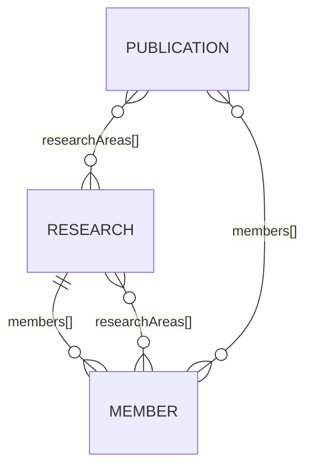

# 04 — Arquitectura de información

| Campo | Valor |
|---|---|
| Fase | 2 — Arquitectura de información |
| Versión | 1.2 (Notes / Notas, ADR-008/009) |
| Fecha | 2026-09-23 |
| Estado | `APPROVED` |

---

## 1. Sitemap

> v1.2 (2026-09-29): se añaden Notes / Notas (VIEW-007, cambio Tipo C) y Galería (VIEW-008).
>
> v1.1 (2026-09-24, ADR-007): el inglés es el idioma por defecto y va sin prefijo; el español va bajo `/es/`. "Nosotros" se integró en Inicio en v1.5.

```text
EN (idioma por defecto, sin prefijo)   ES (/es/)
/                        VIEW-001       /es/
/research/               VIEW-003       /es/investigacion/
/research/<slug-en>/     VIEW-003-D     /es/investigacion/<slug-es>/
/team/                   VIEW-004       /es/integrantes/
/team/<slug>/            VIEW-004-D     /es/integrantes/<slug>/
/publications/           VIEW-005       /es/publicaciones/
/notes/                  VIEW-007       /es/notas/
/notes/page/<n>/         VIEW-007       /es/notas/pagina/<n>/
/notes/category/<cat>/   VIEW-007-C     /es/notas/categoria/<cat>/
/notes/<slug>/           VIEW-007-D     /es/notas/<slug>/
/gallery/                VIEW-008       /es/galeria/
/contact/                VIEW-006       /es/contacto/
/404                     VIEW-404 (bilingüe, única; primero EN)
```

Profundidad máxima: 2 niveles (sección → detalle).

## 2. Tabla de rutas

| ID | Ruta EN | Ruta ES | Tipo | Fuente de datos |
|---|---|---|---|---|
| VIEW-001 | `/` | `/es/` | estática | research, members, publications |
| VIEW-003 | `/research/` | `/es/investigacion/` | estática | research |
| VIEW-003-D | `/research/[slug]/` | `/es/investigacion/[slug]/` | dinámica (`getStaticPaths`) | research + texts + members + publications |
| VIEW-004 | `/team/` | `/es/integrantes/` | estática | members |
| VIEW-004-D | `/team/[slug]/` | `/es/integrantes/[slug]/` | dinámica | members + texts + research + publications |
| VIEW-005 | `/publications/` | `/es/publicaciones/` | estática | publications + research |
| VIEW-007 | `/notes/` (+ `/notes/page/[n]/`) | `/es/notas/` (+ `/es/notas/pagina/[n]/`) | estática (paginada) | notes + config/notes |
| VIEW-007-C | `/notes/category/[cat]/` | `/es/notas/categoria/[cat]/` | dinámica (`getStaticPaths`) | notes + config/notes |
| VIEW-007-D | `/notes/[slug]/` | `/es/notas/[slug]/` | dinámica | notes + members + research |
| VIEW-008 | `/gallery/` | `/es/galeria/` | estática | config/gallery |
| VIEW-006 | `/contact/` | `/es/contacto/` | estática | site config |
| VIEW-404 | `/404` | — | sistema | i18n (EN + ES en la misma página) |

Rutas anteriores a v1.1:

- las rutas ES sin prefijo (`/contacto/`, `/investigacion/…` y las demás) redirigen con 301 a `/es/…`;
- las rutas `/en/…` ya no existen.

## 3. Política de slugs

| Entidad | Regla | Ejemplo EN | Ejemplo ES |
|---|---|---|---|
| Secciones | Traducidas | `/research/` | `/es/investigacion/` |
| Líneas de investigación | Slug traducido por idioma, definido en datos | `/research/cluster-structure-prediction/` | `/es/investigacion/prediccion-estructural-de-clusteres/` |
| Integrantes | Slug único derivado del nombre, igual en ambos idiomas | `/team/jose-luis-cabellos/` | `/es/integrantes/jose-luis-cabellos/` |
| Publicaciones | Sin página propia en v1 (se enlaza al DOI) | — | — |
| Notas | Slug único en el idioma de la nota, igual en ambas interfaces (ADR-009) | `/notes/comments-on-orca-6/` | `/es/notas/comments-on-orca-6/` |
| Categorías de notas | Traducidas, definidas en `src/config/notes.ts` | `/notes/category/readings/` | `/es/notas/categoria/lecturas/` |

Reglas: minúsculas, ASCII, guiones, sin acentos y sin fechas. Las URLs no cambian después del release (si cambian, redirección 301 en `public/_redirects`).

## 4. Navegación

### 4.1 Principal (header)

| Orden | ES | EN |
|---|---|---|
| — | Marca → `/es/` | Marca → `/` |
| 1 | Nosotros | About |
| 2 | Investigación | Research |
| 3 | Integrantes | Team |
| 4 | Publicaciones | Publications |
| 5 | Contacto | Contact |
| — | Selector `EN / ES` | Selector `EN / ES` |

"Inicio" no aparece como ítem de menú: lo cubre la marca. Se mantienen los 6 apartados del alcance.

> Menú vigente (v1.2, `navOrder` en `src/i18n/utils.ts`): Home · Research · People · Publications · **Notes** · Gallery · Contact us / Inicio · Investigación · Integrantes · Publicaciones · **Notas** · Galería · Contáctanos. "Nosotros" se integró en Inicio (v1.5).

- **≥ 900 px:** navegación horizontal visible.
- **< 900 px:** botón "Menú" con `aria-expanded` que despliega un panel. Sin JS, el panel queda visible debajo del header (mejora progresiva).
- El ítem activo lleva `aria-current="page"` (también en las vistas de detalle de su sección).

### 4.2 Footer

Marca + nombre descriptivo · institución · enlaces de navegación · perfiles académicos (ORCID, Scholar) · año y créditos.

### 4.3 Breadcrumbs

Solo en detalle: `Inicio › Investigación › <Línea>`, `Inicio › Integrantes › <Nombre>` y `Inicio › Notas › <Título>`.

### 4.4 Selector de idioma

Cada página declara su ruta equivalente (`alternate`). El selector enlaza a esa ruta, nunca al Home por defecto. Usa `hreflang` y `lang` en el enlace y marca el idioma actual con `aria-current`.

## 5. Relaciones entre entidades


```mermaid
erDiagram
    RESEARCH ||--o{ MEMBER : "members[]"
    MEMBER }o--o{ RESEARCH : "researchAreas[]"
    PUBLICATION }o--o{ RESEARCH : "researchAreas[]"
    PUBLICATION }o--o{ MEMBER : "members[]"
```

- La relación **se declara en un solo lado** para evitar inconsistencias:
  - `member.researchAreas[]`, y la línea obtiene sus integrantes por consulta inversa;
  - `publication.researchAreas[]` y `publication.members[]`, y línea/integrante obtienen sus publicaciones por consulta inversa.
- Las referencias se validan en build (`reference()` de Content Collections).

## 6. Enlazado interno (sin páginas huérfanas)

| Desde | Hacia |
|---|---|
| Home | Nosotros, cada línea, Integrantes, perfil del PI, Publicaciones, Contacto |
| Investigación | Cada línea |
| Detalle de línea | Perfiles relacionados, Publicaciones filtradas por la línea, otras líneas |
| Integrantes | Cada perfil |
| Perfil | Sus líneas, Publicaciones (lista completa) |
| Publicaciones | Líneas (filtro), DOI externo |
| Notas | Cada nota, cada categoría |
| Detalle de nota | Perfil del autor, categoría, líneas relacionadas, nota anterior/siguiente, enlaces y PDF |
| 404 | Home EN, Home ES |

Todas las vistas son alcanzables desde el header en ≤ 2 clics.

## 7. User journeys validados

| Journey | Ruta |
|---|---|
| Visitante académico | Home → línea destacada → Detalle → publicación relacionada (DOI) |
| Interesado en persona | Home → Integrantes → Perfil → ORCID / publicación |
| Interesado en producción | Buscador → `/publications/` (o `/es/publicaciones/`) → DOI |
| Institucional | Home → Nosotros → Contacto |

## 8. Filtro de publicaciones (RF-08)

Sin JS ni páginas extra: la lista completa tiene anclas por año (`#y2024`) y por línea (sección *"Por línea de investigación"* con conteos que enlaza al detalle de cada línea, donde está su lista completa). Así se evitan rutas adicionales que habría que traducir e indexar.

## 9. Gate 2

- [x] todas las vistas tienen ID
- [x] cada vista tiene propósito (ver `docs/views/`)
- [x] cada ruta está definida
- [x] ES/EN tiene estrategia
- [x] no hay páginas huérfanas
- [x] breadcrumbs definidos
- [x] navegación móvil considerada
- [x] todo contenido importante tiene ubicación
